# คำอธิบายกราฟ: ปัจจัยที่สัมพันธ์กับ PM2.5 หาดใหญ่ (2021–2025)

ข้อมูลรายวันจากสถานี 44T หาดใหญ่ (`assets/MergeData_HatYai_44T_2021-2025_Clean_Seasons_Only.xlsx`) มีทั้งหมด 1,804 วัน และไม่มีค่าว่าง กราฟทั้งหมดสร้างจาก `notebooks/pm25_factors.ipynb` และบันทึกไว้ที่ `graph/`

> **ข้อควรจำตลอดทั้งเอกสาร:** ทุกกราฟแสดง *ความสัมพันธ์* ไม่ได้พิสูจน์ *เหตุและผล* หน่วยของ PM2.5 คือ มคก./ลบ.ม. (ไมโครกรัมต่อลูกบาศก์เมตร)

## วัตถุประสงค์และกราฟที่ตอบ

| วัตถุประสงค์ | กราฟ |
|---|---|
| ภาพรวมของข้อมูล | 01, 02 |
| 1. ศึกษาปัจจัยที่สัมพันธ์กับปริมาณฝุ่น | 03, 04, 05 |
| 2. ความสัมพันธ์ระหว่างทิศลม ฝน และฝุ่นรายวัน | 06–11 |
| 3. วันทำงานกับวันหยุด และฤดูมรสุมกับช่วงปกติ | 12–16 |
| สรุปรวมทุกปัจจัย | 17 |

## สรุปสั้น ๆ ก่อนอ่าน

1. **ฝนเป็นปัจจัยที่สัมพันธ์กับฝุ่นชัดที่สุด** ฝนสะสม 3 วัน (−0.39) และฝนเมื่อวาน (−0.35) สัมพันธ์แรงกว่าฝนวันนี้ (−0.30) วันที่ฝนตกมีฝุ่นมัธยฐาน 13.0 ส่วนวันที่ไม่มีฝนอยู่ที่ 16.0
2. **ความชื้นมาเป็นอันดับสอง** (−0.27) ส่วน**ความเร็วลมแทบไม่สัมพันธ์** (−0.09)
3. **ทิศลมมีผลบ้าง** ลมจากฝั่งตะวันออกและใต้มาพร้อมฝุ่นสูงกว่าลมฝั่งตะวันตก แต่ผลนี้ปนกับฤดูกาล เพราะลมตะวันออกคือลมหลักของฤดูแล้ง
4. **วันทำงานกับวันหยุดสุดสัปดาห์ไม่ต่างกัน** (14.8 กับ 14.9, p = 0.68)
5. **ฤดูมรสุมฝุ่นต่ำกว่าช่วงปกติ** (มัธยฐาน 13.9 กับ 15.0, p < 0.001) แต่ความต่างนี้มาจาก**ฤดูแล้ง**เป็นหลัก ฤดูแล้งมีมัธยฐาน 17.0 สูงที่สุดของปี
6. **ฝุ่นลดลงชัดในปี 2024–2025** ตัวแปรสภาพอากาศในข้อมูลนี้อธิบายการลดลงนี้ไม่ได้

## นิยามที่ใช้

- **ฤดูกาล** ใช้คอลัมน์ `season` ในไฟล์ ซึ่งแบ่งเป็น 4 ช่วง

  | ฤดู | ช่วงวันที่ | จำนวนวัน |
  |---|---|---|
  | มรสุมตะวันออกเฉียงเหนือ | 16 ต.ค. – ม.ค. | 526 |
  | ฤดูแล้ง | ก.พ. – เม.ย. | 442 |
  | ช่วงเปลี่ยนมรสุม | พ.ค. – มิ.ย. | 305 |
  | ช่วงหมอกควันข้ามแดน | ก.ค. – 15 ต.ค. | 531 |

- **ฤดูมรสุม vs ช่วงปกติ:** "ฤดูมรสุม" คือมรสุมตะวันออกเฉียงเหนือ ซึ่งเป็นช่วงฝนหลักของหาดใหญ่ "ช่วงปกติ" คืออีก 3 ฤดูรวมกัน
- **ทิศลม** คือทิศที่ลมพัดมา (0° = เหนือ, 90° = ตะวันออก) แบ่งเป็น 8 ทิศ
- **ฝนเมื่อวาน / ฝนสะสม 3 วัน** คำนวณเฉพาะวันที่ต่อเนื่องกัน เพราะในข้อมูลมี 8 จุดที่วันที่ขาดหายไป

---

## 1. ภาพรวมของ PM2.5

### 01 PM2.5 รายวัน

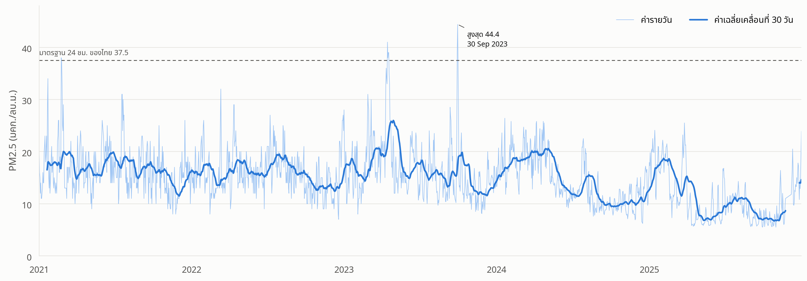

**กราฟนี้แสดงอะไร:** เส้นสีฟ้าอ่อนคือค่ารายวัน เส้นสีน้ำเงินเข้มคือค่าเฉลี่ยเคลื่อนที่ 30 วัน เส้นประคือมาตรฐาน PM2.5 เฉลี่ย 24 ชั่วโมงของไทย (37.5)

**สิ่งที่พบ**
- ค่าเฉลี่ยรายปีคงที่ช่วง 2021–2023 แล้ว**ลดลงชัด**ในปี 2024–2025

  | ปี | ค่าเฉลี่ย | มัธยฐาน | SD |
  |---|---|---|---|
  | 2021 | 16.68 | 16.0 | 4.57 |
  | 2022 | 15.92 | 15.0 | 4.03 |
  | 2023 | 16.61 | 15.2 | 5.90 |
  | 2024 | 14.30 | 13.2 | 4.66 |
  | 2025 | 10.99 | 9.8 | 4.76 |

- ตลอด 5 ปีมีเพียง **7 วัน**ที่เกินมาตรฐาน 37.5 และทุกวันอยู่ในสองช่วงนี้
  - ฤดูแล้ง: 23 ก.พ. 2021 และ 15–18 เม.ย. 2023
  - ช่วงหมอกควันข้ามแดน: 29–30 ก.ย. 2023
- ค่าสูงสุดของชุดข้อมูลคือ **44.4** เมื่อวันที่ 30 ก.ย. 2023

**ข้อควรตรวจสอบ:** ค่าที่ลดลงมากในปี 2025 อาจเกิดจากอากาศดีขึ้นจริง หรือจากการเปลี่ยนเครื่องมือหรือวิธีวัดของสถานี ควรเช็กกับรายงานของกรมควบคุมมลพิษก่อนสรุป

### 02 PM2.5 แยกตามเดือน

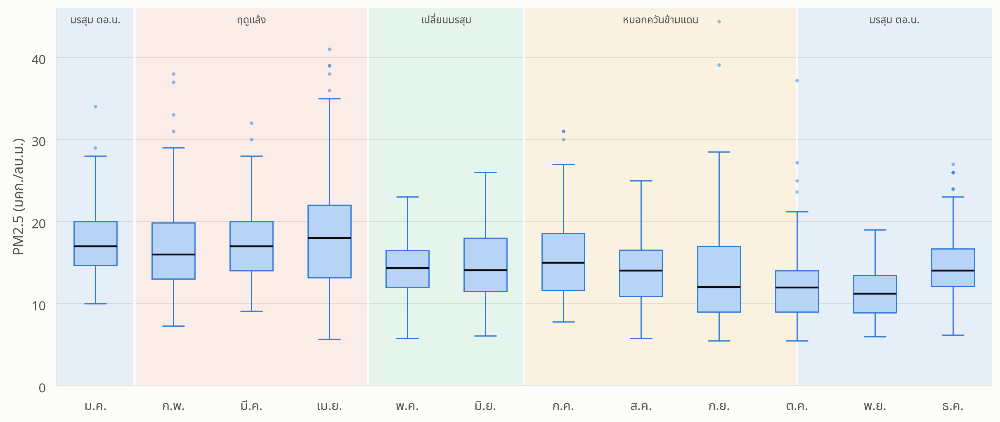

**กราฟนี้แสดงอะไร:** box plot ของแต่ละเดือน (รวมทุกปี) กล่องคือช่วง 25–75% เส้นดำกลางกล่องคือมัธยฐาน สีพื้นหลังบอกฤดู เดือนตุลาคมแบ่งครึ่งระหว่างช่วงหมอกควันกับมรสุม

**สิ่งที่พบ**
- **ม.ค.–เม.ย. สูงที่สุด** มัธยฐาน 16–18 โดยเมษายนสูงสุด (18.0) และกล่องกว้างที่สุด
- **ต.ค.–พ.ย. ต่ำที่สุด** มัธยฐาน 11–12
- ก.ย. มีมัธยฐานต่ำ (12.0) แต่มีจุด outlier สูงถึง 44.4 แปลว่าเดือนนี้ปกติสะอาด แต่บางปีมีเหตุการณ์ฝุ่นสูงเฉียบพลัน
- มกราคมอยู่ในฤดูมรสุมแต่ฝุ่นยังสูง (17.0) เพราะเป็นปลายมรสุมที่ฝนเริ่มน้อยลงแล้ว

**ข้อสรุป:** ฤดูกาลเป็นกรอบใหญ่ ปัจจัยอื่นในกราฟต่อ ๆ ไปซ้อนอยู่ภายในรูปแบบนี้

---

## 2. วัตถุประสงค์ 1: ปัจจัยที่สัมพันธ์กับ PM2.5

ใช้ **Spearman correlation** แทน Pearson เพราะฝนมีการกระจายเบ้มาก (50% ของวันไม่มีฝน) และความสัมพันธ์บางตัวไม่เป็นเส้นตรง ค่า r อยู่ระหว่าง −1 ถึง 1 ค่าลบแปลว่าตัวแปรนั้นมากขึ้นแล้วฝุ่นลดลง

### 03 จัดอันดับความสัมพันธ์กับ PM2.5

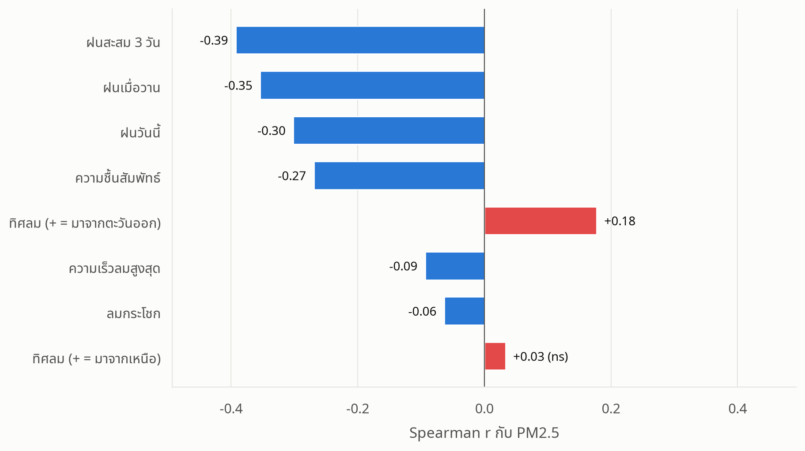

**กราฟนี้แสดงอะไร:** ค่า Spearman r ของแต่ละปัจจัยกับ PM2.5 เรียงจากสัมพันธ์มากไปน้อย แท่งฟ้าคือสัมพันธ์ทางลบ แท่งแดงคือสัมพันธ์ทางบวก "(ns)" คือไม่มีนัยสำคัญที่ระดับ 0.05

| ปัจจัย | Spearman r | p-value |
|---|---|---|
| ฝนสะสม 3 วัน | −0.39 | < 0.001 |
| ฝนเมื่อวาน | −0.35 | < 0.001 |
| ฝนวันนี้ | −0.30 | < 0.001 |
| ความชื้นสัมพัทธ์ | −0.27 | < 0.001 |
| ทิศลม (+ = มาจากตะวันออก) | +0.18 | < 0.001 |
| ความเร็วลมสูงสุด | −0.09 | < 0.001 |
| ลมกระโชก | −0.06 | 0.007 |
| ทิศลม (+ = มาจากเหนือ) | +0.03 | 0.15 (ไม่มีนัยสำคัญ) |

**สิ่งที่พบ**
- **ฝนทั้ง 3 แบบอยู่อันดับต้น** และฝนย้อนหลังสัมพันธ์แรงกว่าฝนวันเดียวกัน
- **ความชื้น**มาเป็นอันดับถัดไป
- **ทิศลม +0.18** แปลว่าลมจากฝั่งตะวันออกมาพร้อมฝุ่นมากขึ้นเล็กน้อย ส่วนแกนเหนือ–ใต้ไม่มีผล
- **ความเร็วลม**แทบไม่สัมพันธ์

**ข้อควรระวัง:** ข้อมูลมีประมาณ 1,800 วัน ค่า r เล็ก ๆ อย่าง −0.09 ก็ได้ p < 0.05 ได้ ควรดู**ขนาดของ r** ประกอบด้วย ไม่ใช่ดูแค่ p-value

**ข้อสังเกต:** ไม่มีปัจจัยใดเกิน |0.4| แปลว่า**ไม่มีปัจจัยเดียวที่อธิบายฝุ่นได้ทั้งหมด**

### 04 สหสัมพันธ์ระหว่างปัจจัยทั้งหมด

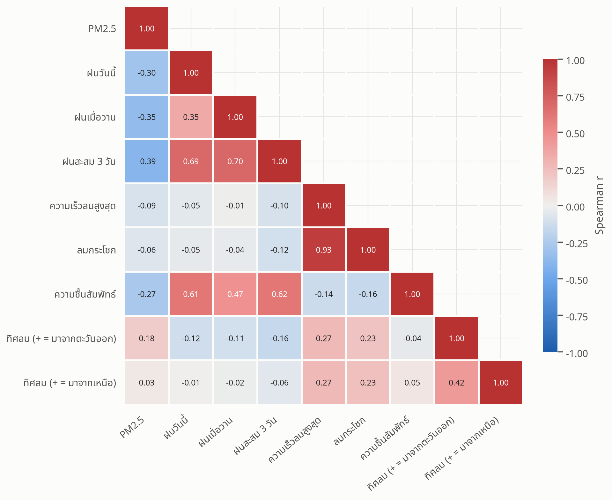

**กราฟนี้แสดงอะไร:** ค่า Spearman ระหว่างทุกคู่ตัวแปร สีแดงคือสัมพันธ์ไปทางเดียวกัน สีน้ำเงินคือสัมพันธ์สวนทางกัน ยิ่งเข้มยิ่งสัมพันธ์มาก

**วิธีอ่าน:** คอลัมน์แรก (PM2.5) คือตัวเลขชุดเดียวกับกราฟ 03 ช่องที่เหลือเป็นความสัมพันธ์ระหว่างปัจจัยด้วยกันเอง

**สิ่งที่พบ**
- **ฝนกับความชื้นสัมพันธ์กันเอง (0.61)** ผลของความชื้นต่อฝุ่นจึงซ้อนกับผลของฝนบางส่วน
- **ลมสูงสุดกับลมกระโชกสัมพันธ์กันถึง 0.93** แทบเป็นข้อมูลเดียวกัน
- ฝนวันนี้ ฝนเมื่อวาน และฝนสะสม 3 วัน สัมพันธ์กันเองสูง

**ทำไมต้องดูกราฟนี้:** ถ้าเอาตัวแปรที่ซ้ำกันใส่โมเดลพร้อมกัน ความสำคัญจะถูกแบ่งกันจนอ่านผิด โมเดลในกราฟ 17 จึงไม่ใส่ลมกระโชกและฝนสะสม 3 วัน

### 05 Scatter plot แต่ละปัจจัย

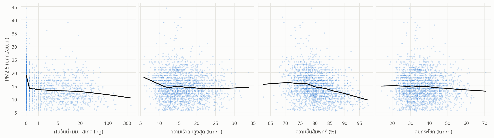

**กราฟนี้แสดงอะไร:** แต่ละจุดคือหนึ่งวัน เส้นดำคือ LOWESS ซึ่งเป็นเส้นแนวโน้มที่โค้งตามข้อมูลได้ แกนฝนใช้สเกล log เพราะฝนส่วนใหญ่อยู่ใกล้ 0

**สิ่งที่พบ**
- **ฝน:** เส้นตกฮวบจากประมาณ 19 ที่ฝน = 0 เหลือประมาณ 14 เมื่อมีฝนเล็กน้อย แล้วค่อนข้างราบ ผลของฝนจึงเป็นแบบ**มีหรือไม่มี** มากกว่าแบบยิ่งมากยิ่งดี
- **ความเร็วลม:** เส้นลดลงเฉพาะช่วงลมอ่อนมาก (ต่ำกว่า 10 km/h มัธยฐาน 16.5) หลังจากนั้นแบนราบที่ประมาณ 14
- **ความชื้น:** เส้นเริ่มลดลงเมื่อความชื้นเกินประมาณ 78%

  | ความชื้น | มัธยฐาน PM2.5 |
  |---|---|
  | ≤ 75% | 16.0 |
  | 75–80% | 15.0 |
  | 80–85% | 14.0 |
  | > 85% | 12.0 |

- **ลมกระโชก:** แทบเป็นเส้นตรงแนวนอน

---

## 3. วัตถุประสงค์ 2: ทิศลม ปริมาณฝน กับ PM2.5 รายวัน

### 06 ทิศลมกับ PM2.5

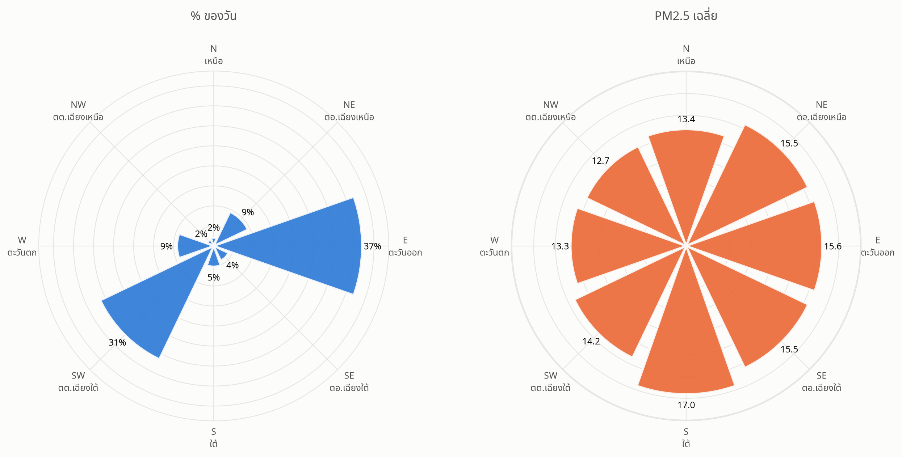

**กราฟนี้แสดงอะไร**
- **ซ้าย:** แต่ละแท่งคือสัดส่วนวันที่ลมพัดมาจากทิศนั้น
- **ขวา:** แต่ละแท่งคือ PM2.5 เฉลี่ยของวันที่ลมมาจากทิศนั้น

| ทิศลม | % ของวัน | PM2.5 เฉลี่ย | จำนวนวัน |
|---|---|---|---|
| เหนือ (N) | 2.1% | 13.4 | 37 |
| ตะวันออกเฉียงเหนือ (NE) | 9.4% | 15.5 | 170 |
| ตะวันออก (E) | 37.0% | 15.6 | 668 |
| ตะวันออกเฉียงใต้ (SE) | 4.0% | 15.5 | 73 |
| ใต้ (S) | 5.2% | **17.0** | 93 |
| ตะวันตกเฉียงใต้ (SW) | 31.4% | 14.2 | 566 |
| ตะวันตก (W) | 9.1% | 13.3 | 165 |
| ตะวันตกเฉียงเหนือ (NW) | 1.8% | 12.7 | 32 |

**สิ่งที่พบ**
- ลมที่หาดใหญ่มาจากสองทิศหลัก คือ**ตะวันออก**และ**ตะวันตกเฉียงใต้** รวมกันเกือบ 70% ของวัน
- ลมจาก**ฝั่งตะวันออกและใต้** (NE, E, SE, S) ฝุ่นเฉลี่ย 15.5–17.0
- ลมจาก**ฝั่งตะวันตก** (SW, W, NW) ฝุ่นเฉลี่ยต่ำกว่า คือ 12.7–14.2

**ข้อควรระวัง:** ลมจากทิศเหนือและตะวันตกเฉียงเหนือมีเพียง 37 และ 32 วัน ค่าเฉลี่ยของสองทิศนี้จึงไม่เสถียร

### 07 การกระจายของ PM2.5 ตามทิศลม

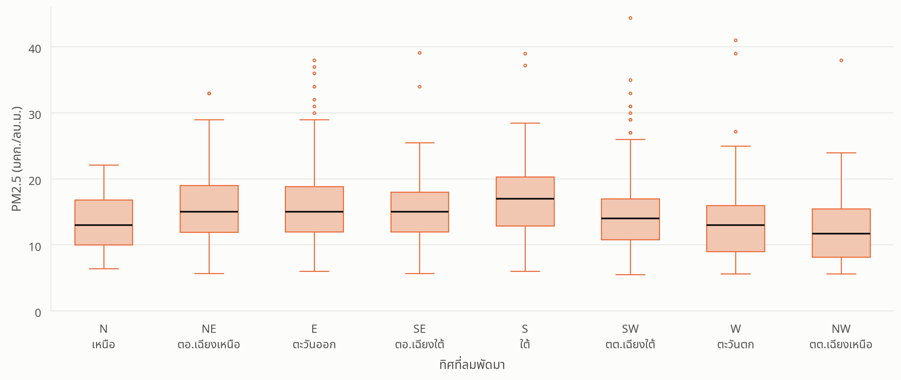

**กราฟนี้แสดงอะไร:** box plot ของ PM2.5 แยกตาม 8 ทิศ เรียงตามเข็มนาฬิกาจากทิศเหนือ (จำนวนวันของแต่ละทิศดูได้จากตารางในข้อ 06)

**สิ่งที่พบ**
- **ลมทิศใต้**มีมัธยฐานสูงที่สุด (17.0) ทิศตะวันตกเฉียงเหนือต่ำที่สุด (11.7)
- ลมตะวันออกและตะวันตกเฉียงใต้มีจุด outlier ค่าสูงมากที่สุด เพราะเป็นทิศที่มีจำนวนวันมากที่สุด
- Kruskal–Wallis p < 0.001 แปลว่าฝุ่นในแต่ละทิศต่างกันจริง แต่ความต่างของมัธยฐานมีเพียงประมาณ 5 หน่วย

### 08 Wind rose: วันฝุ่นสูงกับวันอื่น

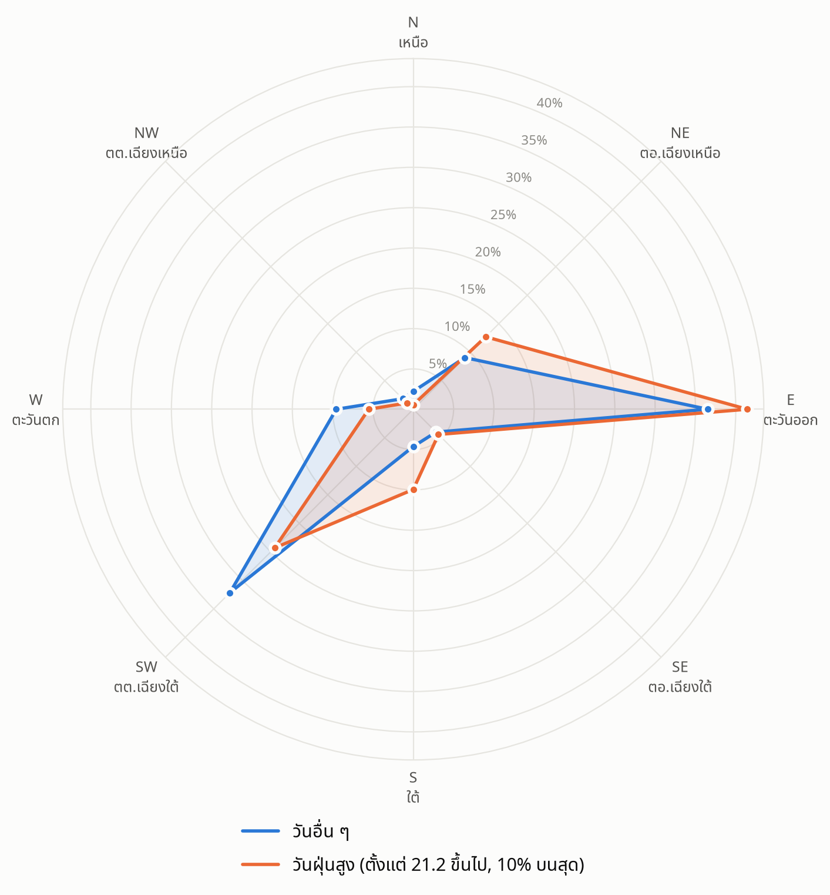

**กราฟนี้แสดงอะไร:** แต่ละจุดคือสัดส่วนวันในกลุ่มนั้นที่ลมมาจากทิศนั้น
- **สีน้ำเงิน:** วันอื่น ๆ (PM2.5 ต่ำกว่า 21.2)
- **สีส้ม:** วันฝุ่นสูงสุด 10% (PM2.5 ตั้งแต่ 21.2 ขึ้นไป)

| ทิศลม | วันอื่น ๆ | วันฝุ่นสูง | เปลี่ยนไป |
|---|---|---|---|
| ตะวันออก (E) | 36.5% | 41.4% | เพิ่มขึ้น |
| ตะวันออกเฉียงเหนือ (NE) | 9.1% | 12.7% | เพิ่มขึ้น |
| ใต้ (S) | 4.6% | 9.9% | เพิ่มขึ้นเกือบเท่าตัว |
| ตะวันตกเฉียงใต้ (SW) | 32.2% | 24.3% | ลดลง |
| ตะวันตก (W) | 9.6% | 5.5% | ลดลง |

**สิ่งที่พบ:** ในวันฝุ่นสูง ลมจาก**ตะวันออก ตะวันออกเฉียงเหนือ และใต้**มีสัดส่วนเพิ่มขึ้น ส่วนลมจาก**ตะวันตกเฉียงใต้และตะวันตก**ลดลง ซึ่งตรงกับกราฟ 06

**ข้อควรระวัง:** ทิศลมผูกกับฤดูมาก ลมตะวันออกคือลมหลักของฤดูแล้ง (ดูกราฟ 16) ผลของทิศลมจึงปนกับผลของฤดู

### 09 PM2.5 แยกตามปริมาณฝน

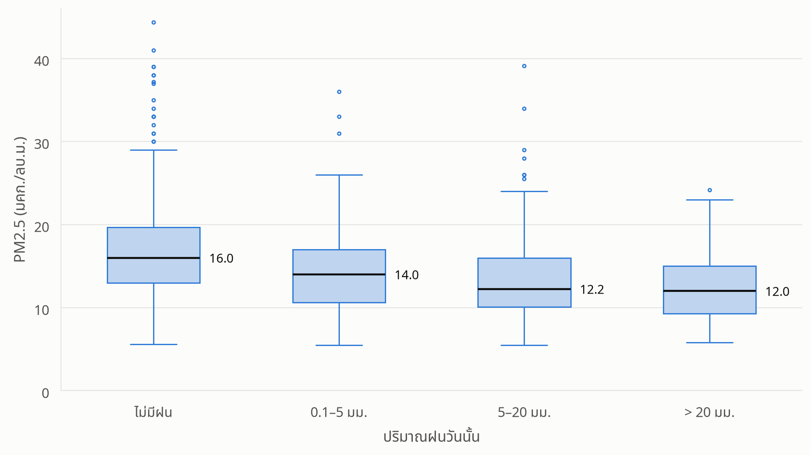

**กราฟนี้แสดงอะไร:** box plot ของ PM2.5 แยกเป็น 4 กลุ่มตามฝนวันนั้น ตัวเลขข้างกล่องคือมัธยฐาน

| ฝนวันนั้น | มัธยฐาน | ค่าเฉลี่ย | จำนวนวัน |
|---|---|---|---|
| ไม่มีฝน | 16.0 | 16.4 | 901 |
| 0.1–5 มม. | 14.0 | 13.8 | 466 |
| 5–20 มม. | 12.2 | 13.3 | 284 |
| > 20 มม. | 12.0 | 12.5 | 153 |

**สิ่งที่พบ**
- มัธยฐานลดลงเป็นขั้นบันได: 16.0 → 14.0 → 12.2 → 12.0
- **ผลมากที่สุดอยู่ที่ช่วงจากไม่มีฝนเป็นมีฝนเล็กน้อย** เมื่อเกิน 5 มม. แล้ว ฝนที่มากขึ้นแทบไม่ลดฝุ่นเพิ่ม
- วันที่ไม่มีฝนมีจุด outlier สูงมากที่สุด วันฝุ่นสูงเกือบทั้งหมดจึงเป็นวันที่ไม่มีฝน

### 10 ผลของฝนย้อนหลัง

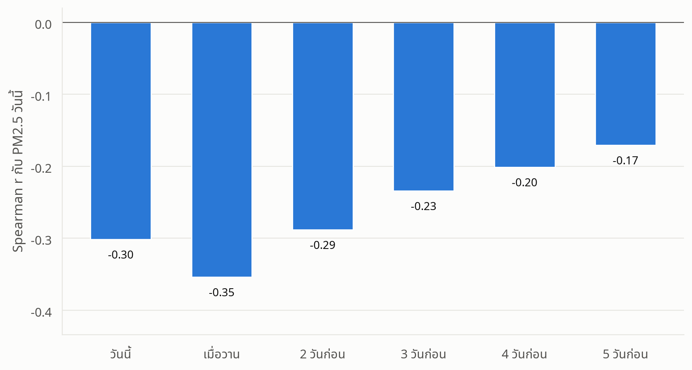

**กราฟนี้แสดงอะไร:** Spearman r ระหว่าง PM2.5 วันนี้กับฝนของวันนี้ เมื่อวาน และย้อนหลังไปจนถึง 5 วันก่อน

| ฝนของ | Spearman r |
|---|---|
| วันนี้ | −0.30 |
| เมื่อวาน | **−0.35** |
| 2 วันก่อน | −0.29 |
| 3 วันก่อน | −0.23 |
| 4 วันก่อน | −0.20 |
| 5 วันก่อน | −0.17 |

**สิ่งที่พบ**
- **ฝนเมื่อวานสัมพันธ์กับฝุ่นวันนี้มากกว่าฝนวันนี้** สอดคล้องกับที่ฝนชะฝุ่นออกจากอากาศแล้วส่งผลต่อเนื่องไปวันรุ่งขึ้น อีกเหตุผลคือค่า PM2.5 เป็นค่าเฉลี่ยทั้งวัน ฝนที่ตกตอนบ่ายหรือเย็นจึงยังไม่ทันลดค่าเฉลี่ยของวันนั้น
- ผลของฝนค่อย ๆ จางลง แต่ผ่านไป 5 วันก็ยังเหลือ −0.17

**ข้อควรระวัง:** ฝนมักตกติดกันหลายวัน ค่า r ของฝนย้อนหลังจึงรวมผลของฝนวันใกล้ ๆ ไว้ด้วย

### 11 ทิศลมและฝนร่วมกัน

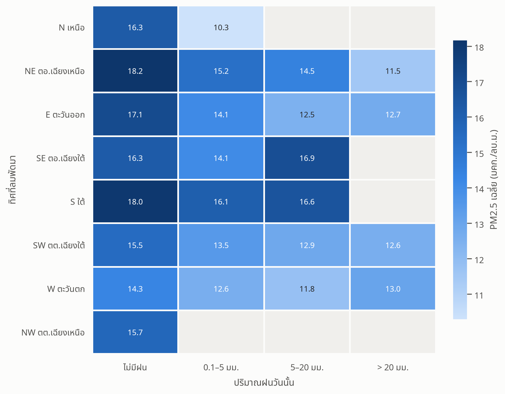

**กราฟนี้แสดงอะไร:** แต่ละช่องคือ PM2.5 เฉลี่ยของวันที่มีทิศลมและปริมาณฝนตามแถวและคอลัมน์นั้น ช่องสีเทาคือมีข้อมูลน้อยกว่า 10 วัน ยิ่งสีเข้มยิ่งฝุ่นมาก

**สิ่งที่พบ**
- **ในเกือบทุกทิศลม ฝนตกมากขึ้นฝุ่นก็ลดลง** เช่น
  - ลมตะวันออก: 17.1 (ไม่มีฝน) → 12.5–12.7 (ฝนเกิน 5 มม.)
  - ลมตะวันออกเฉียงเหนือ: 18.2 → 11.5
- ช่องที่ฝุ่นสูงสุดคือ **ลมตะวันออกเฉียงเหนือ + ไม่มีฝน (18.2)** และ**ลมใต้ + ไม่มีฝน (18.0)**
- ลมตะวันตกเฉียงใต้และตะวันตกมีฝุ่นต่ำกว่าทิศอื่นแม้ไม่มีฝน (14.3–15.5)

**ข้อสรุป:** ผลของฝนไม่ได้เป็นแค่เงาของทิศลม ทั้งสองปัจจัยมีผลซ้อนกัน

---

## 4. วัตถุประสงค์ 3: วันทำงาน vs วันหยุด และฤดูมรสุม vs ช่วงปกติ

ใช้ **Mann–Whitney U** เทียบสองกลุ่ม และ **Kruskal–Wallis** เทียบหลายกลุ่ม เพราะ PM2.5 เบ้ขวา ไม่ใช่การแจกแจงปกติ

### 12 วันทำงานเทียบกับวันหยุด

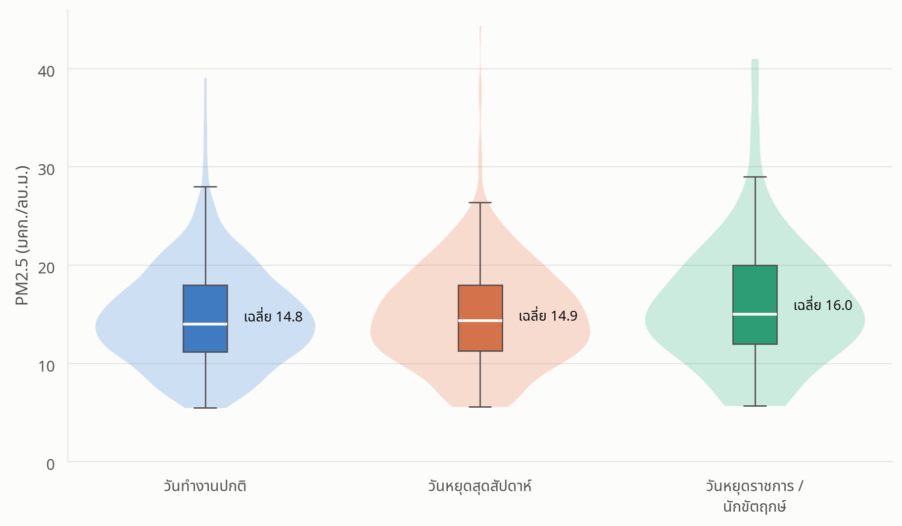

**กราฟนี้แสดงอะไร:** รูปทรงสีอ่อน (violin) คือการกระจายของข้อมูล ยิ่งกว้างยิ่งมีวันที่ค่านั้นมาก กล่องตรงกลางคือ box plot เส้นขาวคือมัธยฐาน

| ประเภทวัน | ค่าเฉลี่ย | มัธยฐาน | จำนวนวัน |
|---|---|---|---|
| วันทำงานปกติ | 14.8 | 14.0 | 1,179 |
| วันหยุดสุดสัปดาห์ | 14.9 | 14.4 | 490 |
| วันหยุดราชการ/นักขัตฤกษ์ | 16.0 | 15.0 | 135 |

**สิ่งที่พบ**
- **วันทำงานกับวันหยุดสุดสัปดาห์ไม่ต่างกัน** (p = 0.68) รูปทรง violin แทบเหมือนกัน
- วันหยุดราชการสูงกว่าเล็กน้อย แต่ยังไม่ถึงเกณฑ์นัยสำคัญ (p = 0.06)
- เทียบทั้ง 3 กลุ่มพร้อมกัน Kruskal–Wallis p = 0.17

**ข้อสรุป:** กิจกรรมที่ต่างกันระหว่างวันทำงานกับวันหยุด เช่น การจราจร ไม่ได้ทำให้ฝุ่นรายวันต่างกันจนมองเห็นได้

### 13 ประเภทวันภายในแต่ละฤดู

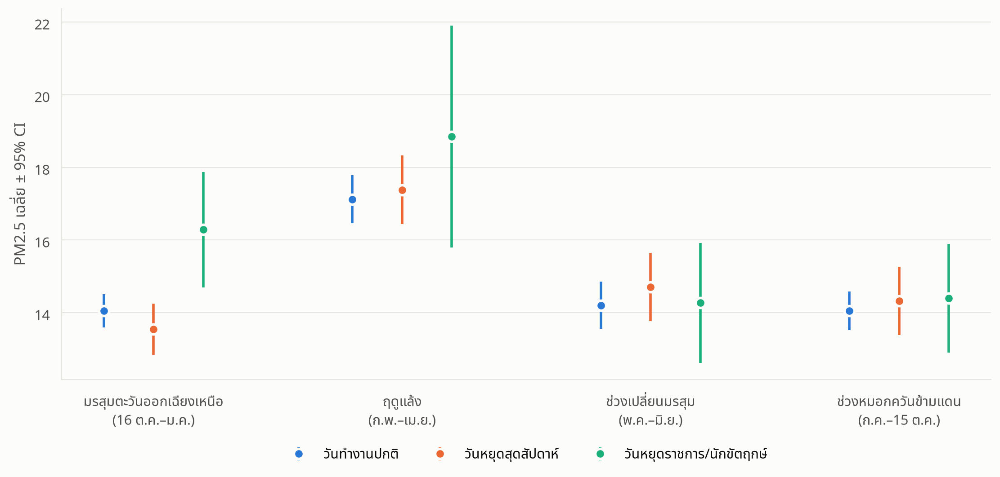

**กราฟนี้แสดงอะไร:** จุดคือ PM2.5 เฉลี่ย เส้นตั้งคือช่วงความเชื่อมั่น 95% แยกตามฤดู กราฟนี้ใช้ตรวจว่าความต่างในกราฟ 12 เกิดจากการที่วันหยุดกระจายไม่เท่ากันในแต่ละฤดูหรือไม่

**วิธีอ่าน:** ถ้าเส้นตั้งของสองกลุ่มซ้อนกันมาก แปลว่าความต่างนั้นอาจเป็นแค่ความบังเอิญ

**สิ่งที่พบ**
- วันทำงานกับวันหยุดสุดสัปดาห์**ใกล้กันมากในทุกฤดู**
- วันหยุดราชการสูงเด่นเฉพาะใน**มรสุม** (16.3 เทียบกับวันทำงาน 14.1) และ**ฤดูแล้ง** (18.9 เทียบกับ 17.1)
- สาเหตุที่น่าจะเป็นคือ**วันหยุดยาวตรงกับเดือนที่ฝุ่นสูงอยู่แล้ว**
  - วันหยุดในฤดูแล้ง 27 จาก 34 วันอยู่ในเดือนเมษายน (สงกรานต์) ซึ่งเป็นเดือนที่ฝุ่นสูงที่สุดของปี
  - วันหยุดในฤดูมรสุมรวมปีใหม่ในเดือนมกราคม ซึ่งฝุ่นก็สูงเช่นกัน (ดูกราฟ 02)

**ข้อควรระวัง:** วันหยุดราชการในแต่ละฤดูมีเพียง 32–36 วัน ช่วงความเชื่อมั่นจึงกว้าง

### 14 ฤดูกาล และฤดูมรสุม vs ช่วงปกติ

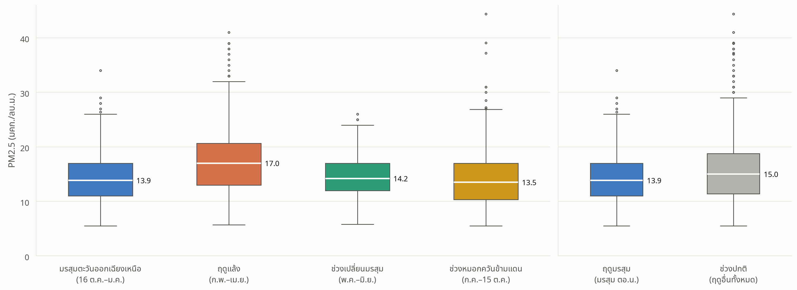

**กราฟนี้แสดงอะไร**
- **ซ้าย:** box plot ของ 4 ฤดู ตัวเลขข้างกล่องคือมัธยฐาน
- **ขวา:** ฤดูมรสุม (สีน้ำเงิน) เทียบกับช่วงปกติ (สีเทา) ซึ่งคือ 3 ฤดูที่เหลือรวมกัน

| ฤดู | มัธยฐาน PM2.5 | ค่าเฉลี่ย | วันที่ฝนตก | ความชื้นมัธยฐาน | ความเร็วลมมัธยฐาน |
|---|---|---|---|---|---|
| มรสุมตะวันออกเฉียงเหนือ | 13.9 | 14.1 | 62% | 83.4% | 17.3 km/h |
| ฤดูแล้ง | **17.0** | 17.3 | 30% | 76.9% | 17.1 km/h |
| ช่วงเปลี่ยนมรสุม | 14.2 | 14.3 | 52% | 79.4% | 13.6 km/h |
| ช่วงหมอกควันข้ามแดน | 13.5 | 14.1 | 53% | 79.9% | 14.6 km/h |

**สิ่งที่พบ**
- **ฤดูแล้งฝุ่นสูงที่สุด** และมีวันฝนตกน้อยที่สุด (30%) ส่วนอีก 3 ฤดูใกล้กัน (13.5–14.2)
- 4 ฤดูต่างกันอย่างมีนัยสำคัญ (Kruskal–Wallis p < 0.001)
- **ฤดูมรสุมฝุ่นต่ำกว่าช่วงปกติ** มัธยฐาน 13.9 เทียบกับ 15.0 (Mann–Whitney p < 0.001)

**ข้อควรระวัง:** ความต่างระหว่างมรสุมกับช่วงปกติมาจาก**ฤดูแล้ง**ที่อยู่ในกลุ่มช่วงปกติเป็นหลัก ถ้าเทียบมรสุมกับช่วงเปลี่ยนมรสุมหรือช่วงหมอกควันโดยตรง ค่าแทบเท่ากัน

### 15 ระดับคุณภาพอากาศในแต่ละฤดู

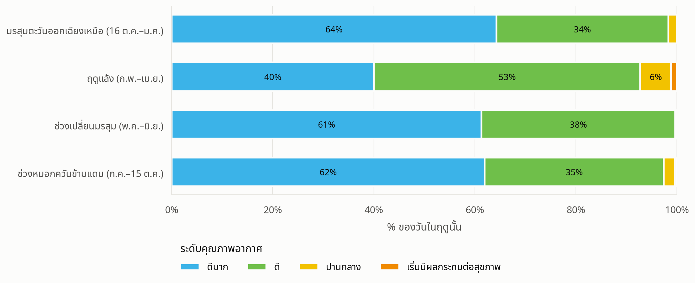

**กราฟนี้แสดงอะไร:** แต่ละแถบคือ 100% ของวันในฤดูนั้น แบ่งสีตามระดับคุณภาพอากาศ (TH AQI) สีตามแบบของกรมควบคุมมลพิษ

| ฤดู | ดีมาก | ดี | ปานกลาง | เริ่มมีผลกระทบต่อสุขภาพ |
|---|---|---|---|---|
| มรสุมตะวันออกเฉียงเหนือ | 64.3% | 34.0% | 1.7% | 0% |
| ฤดูแล้ง | **40.0%** | 52.7% | 6.1% | 1.1% |
| ช่วงเปลี่ยนมรสุม | 61.3% | 38.4% | 0.3% | 0% |
| ช่วงหมอกควันข้ามแดน | 62.0% | 35.4% | 2.3% | 0.4% |

**สิ่งที่พบ**
- ฤดูแล้งเป็นฤดูเดียวที่วัน**ดี**มีมากกว่าวัน**ดีมาก**
- วัน**เริ่มมีผลกระทบต่อสุขภาพ**มีทั้งหมด 7 วัน อยู่ในฤดูแล้ง 5 วัน และช่วงหมอกควัน 2 วัน
- ตลอด 5 ปีไม่มีวันไหนถึงระดับ**มีผลกระทบต่อสุขภาพ** (สีแดง)

### 16 ทิศลมในแต่ละฤดู

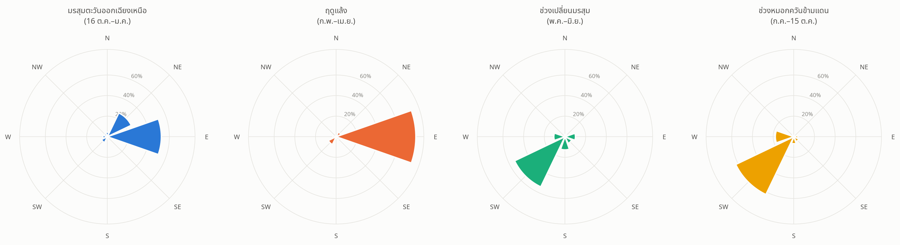

**กราฟนี้แสดงอะไร:** สัดส่วนวันตามทิศลมในแต่ละฤดู (มัธยฐาน PM2.5 ของแต่ละฤดูดูได้จากตารางในข้อ 14)

| ฤดู | ทิศลมหลัก |
|---|---|
| มรสุมตะวันออกเฉียงเหนือ | ตะวันออก 52%, ตะวันออกเฉียงเหนือ 26% |
| ฤดูแล้ง | ตะวันออก **77%** |
| ช่วงเปลี่ยนมรสุม | ตะวันตกเฉียงใต้ 54% |
| ช่วงหมอกควันข้ามแดน | ตะวันตกเฉียงใต้ 62%, ตะวันตก 18% |

**สิ่งที่พบ**
- ฤดูแล้งมีทั้ง**ลมตะวันออกเกือบทั้งหมด**และ**ฝนน้อย** จึงเป็นเหตุผลที่ลมตะวันออกดูสัมพันธ์กับฝุ่นสูงในกราฟ 03, 06 และ 08
- มรสุมก็มีลมตะวันออกเป็นหลักเหมือนกัน แต่มีฝนมาก (62% ของวัน) ฝุ่นจึงต่ำ แปลว่า**ฝนสำคัญกว่าทิศลม**
- ช่วงหมอกควันข้ามแดนมีลมตะวันตกเฉียงใต้เป็นหลัก ค่าเฉลี่ยไม่สูง แต่มีวันพีกรุนแรง เช่น 29–30 ก.ย. 2023

**ข้อสรุป:** ทิศลมกับฤดูกาลพันกันมาก ต้องอ่านกราฟ 06–08 คู่กับกราฟนี้เสมอ

---

## 5. สรุปรวม: ปัจจัยไหนสำคัญที่สุดเมื่อดูพร้อมกัน

### 17 Permutation importance จาก Random Forest

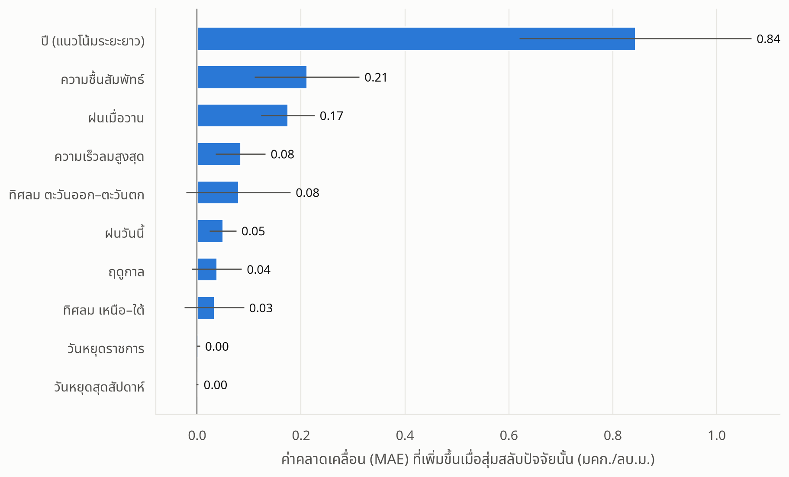

**กราฟนี้แสดงอะไร:** ใช้ Random Forest ทำนาย PM2.5 จากทุกปัจจัยพร้อมกัน แล้ววัดว่าถ้า**สุ่มสลับค่า**ของปัจจัยหนึ่ง ค่าคลาดเคลื่อน (MAE) เพิ่มขึ้นเท่าไร ยิ่งเพิ่มมาก ปัจจัยนั้นยิ่งสำคัญ เส้นขีดคือ ±1 SD ระหว่าง 5 fold

**วิธีสร้างโมเดล**
- ใส่ **ปี** เป็นตัวแปรด้วย เพื่อให้โมเดลแยกแนวโน้มระยะยาวออกจากผลของสภาพอากาศ
- ประเมินแบบ cross-validation 5 fold โดยแบ่งข้อมูลเป็น**ก้อนรายเดือน** วันในเดือนเดียวกันอยู่ fold เดียวกัน เพื่อไม่ให้วันที่ติดกันรั่วข้ามระหว่าง train กับ test
- ไม่ใส่ลมกระโชกและฝนสะสม 3 วัน เพราะซ้ำกับลมสูงสุดและฝนวันนี้/เมื่อวาน (ดูกราฟ 04)
- โมเดลได้ **R² = 0.32** และ **MAE = 3.25** มคก./ลบ.ม.

| ปัจจัย | MAE ที่เพิ่มขึ้น |
|---|---|
| ปี (แนวโน้มระยะยาว) | 0.84 |
| ความชื้นสัมพัทธ์ | 0.21 |
| ฝนเมื่อวาน | 0.17 |
| ความเร็วลมสูงสุด | 0.08 |
| ทิศลม ตะวันออก–ตะวันตก | 0.08 |
| ฝนวันนี้ | 0.05 |
| ฤดูกาล | 0.04 |
| ทิศลม เหนือ–ใต้ | 0.03 |
| วันหยุดราชการ | 0.00 |
| วันหยุดสุดสัปดาห์ | 0.00 |

**สิ่งที่พบ**
- **ปีสำคัญที่สุดอย่างทิ้งห่าง** แปลว่าฝุ่นที่ลดลงในปี 2024–2025 อธิบายด้วยสภาพอากาศในข้อมูลนี้ไม่ได้ น่าจะมาจากปัจจัยภายนอก เช่น แหล่งกำเนิดหรือหมอกควันข้ามแดนที่ลดลง หรือการเปลี่ยนเครื่องมือวัด
- ปัจจัยสภาพอากาศที่สำคัญที่สุดคือ**ความชื้น**และ**ฝนเมื่อวาน**
- **ประเภทวันไม่มีผลเลย** ตรงกับกราฟ 12
- ฤดูกาลมีค่าต่ำ เพราะผลของฤดูถูกความชื้น ฝน และทิศลมรับไปแล้ว ไม่ได้แปลว่าฤดูไม่สำคัญ

**ข้อควรระวัง**
- R² = 0.32 แปลว่าปัจจัยทั้งหมดรวมกันอธิบายการขึ้นลงของฝุ่นรายวันได้ประมาณหนึ่งในสาม ที่เหลือมาจากปัจจัยที่ไม่อยู่ในข้อมูล
- importance นี้เป็นความสำคัญเชิง**พยากรณ์** ไม่ใช่เหตุและผล
- ตัวแปรที่สัมพันธ์กันเอง เช่น ความชื้นกับฝน จะแบ่งความสำคัญกัน ค่าของแต่ละตัวจึงอาจต่ำกว่าผลจริง

---

## ข้อจำกัดของการวิเคราะห์

- มีข้อมูลจาก**สถานีเดียว**
- ค่าฝุ่นของวันที่ติดกันไม่อิสระต่อกัน **ค่า p-value จึงดูดีกว่าความจริง** ควรดูขนาดของความต่างประกอบด้วย
- **ยังขาดตัวแปรสำคัญ** เช่น อุณหภูมิ ความสูงชั้นผสมอากาศ จุดความร้อน (hotspot) และปริมาณจราจร ทำให้อธิบายฤดูแล้งกับการลดลงในปี 2024–2025 ได้ไม่ครบ
- **ฤดูกาลกับทิศลมพันกันมาก** แยกผลของสองอย่างนี้ออกจากกันได้ยาก
- สมมติฐานหมอกควันข้ามแดนในช่วง ก.ค.–ต.ค. **ยังไม่ได้ยืนยัน** ต้องตรวจกับข้อมูล hotspot หรือแบบจำลองเส้นทางลม
