# คำอธิบายกราฟ: ปัจจัยที่สัมพันธ์กับ PM2.5 หาดใหญ่ (2021–2025)

ข้อมูลรายวันจากสถานี 44T หาดใหญ่ มีค่า PM2.5 จำนวน 1,804 วัน จากทั้งหมด 1,826 วัน กราฟทั้งหมดสร้างจาก `notebooks/pm25_factors.ipynb`

> **ข้อควรจำตลอดทั้งเอกสาร:** ทุกกราฟแสดง *ความสัมพันธ์* ไม่ได้พิสูจน์ *เหตุและผล* หน่วยของ PM2.5 คือ มคก./ลบ.ม. (ไมโครกรัมต่อลูกบาศก์เมตร)

## สรุปสั้น ๆ ก่อนอ่าน

1. **ฝนเป็นปัจจัยที่สัมพันธ์กับฝุ่นชัดที่สุด** ฝนเมื่อวานและฝนสะสม 3 วันสัมพันธ์มากกว่าฝนวันเดียวกัน (Spearman ประมาณ −0.35 ถึง −0.37)
2. **ฤดูกาลมีผลมาก** ฝุ่นสูงช่วง ม.ค.–เม.ย. และต่ำช่วง ก.ย.–พ.ย. ในโมเดล ตัวแปรเดือนเป็นตัวที่สำคัญที่สุด
3. **ความเร็วลมมีผลน้อย** ยกเว้นช่วงมรสุมตะวันตกเฉียงใต้ ที่ลมแรงสัมพันธ์กับฝุ่นต่ำ
4. **ทิศลมมีผลบ้าง** วันที่ฝุ่นสูงมักมีลมจากทิศตะวันออกและทิศใต้มากกว่าวันปกติ
5. **ฝุ่นลดลงชัดในปี 2024–2025** ปี 2025 ต่ำผิดปกติ ตัวแปรอากาศที่มีอยู่อธิบายไม่ได้ (โมเดลทำนายปี 2025 ได้ R² = −0.90)
6. **ประเภทวันไม่มีผลอย่างมีนัยสำคัญ** (Kruskal-Wallis p = 0.17)

---

## 2. เตรียมและตรวจข้อมูล

### 2.1 การกระจายของ PM2.5

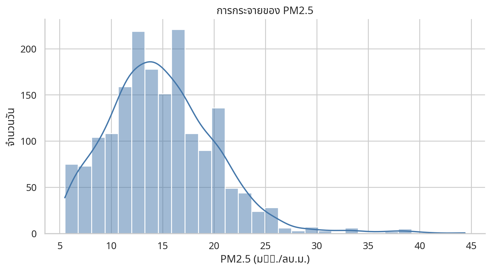

**กราฟนี้แสดงอะไร:** histogram จำนวนวันในแต่ละช่วงค่า PM2.5 พร้อมเส้น KDE ที่แสดงรูปร่างการกระจาย

**สิ่งที่พบ**
- ส่วนใหญ่อยู่ในช่วง **10–20** ค่ากลาง (มัธยฐาน) คือ 14.3 และค่าเฉลี่ย 14.93
- การกระจาย**เบ้ขวา** คือมีหางยาวไปทางค่าสูง (25–44) แต่มีไม่กี่วัน
- แท่งบางแท่งสูงผิดปกติ เช่นที่ 12–13, 16–17 และ 20 น่าจะเกิดจากข้อมูลบางช่วงบันทึกเป็นจำนวนเต็ม ค่าจึงไปกองอยู่ที่ตัวเลขกลม ไม่ได้หมายความว่าฝุ่นชอบอยู่ที่ค่านั้น

**ทำไมต้องดูกราฟนี้:** ข้อมูลเบ้และมีค่าผิดปกติ จึงควรใช้ **Spearman** แทน Pearson และใช้ **มัธยฐาน/box plot** แทนค่าเฉลี่ยในกราฟต่อ ๆ ไป

### 2.2 เปรียบเทียบฝนสองแหล่ง

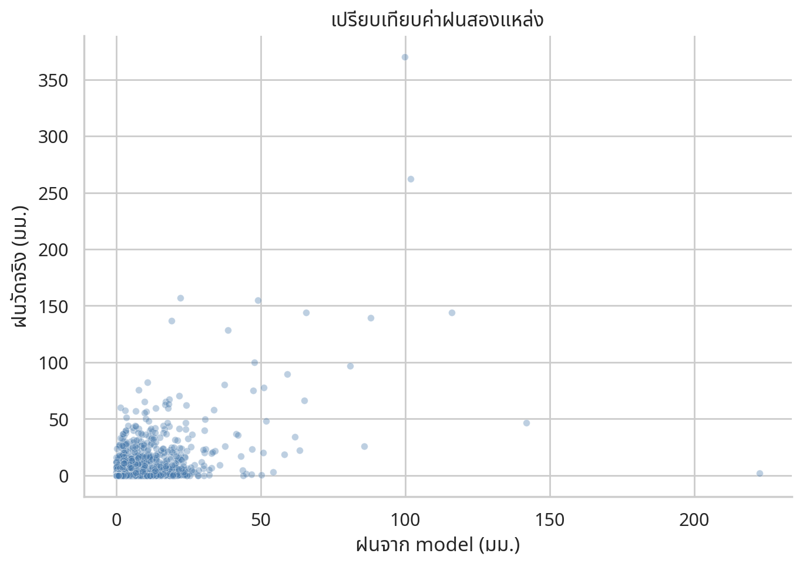

**กราฟนี้แสดงอะไร:** แกน x คือฝนจากโมเดล แกน y คือฝนที่วัดจริง แต่ละจุดคือหนึ่งวัน

**สิ่งที่พบ**
- ถ้าสองแหล่งตรงกัน จุดจะเรียงเป็นเส้นทแยง แต่จุดจริง**กระจายมาก** เช่น
  - มีวันที่วัดได้ 370 มม. แต่โมเดลบอกประมาณ 100 มม.
  - มีวันที่โมเดลบอก 222 มม. แต่วัดได้เกือบ 0
- จุดส่วนใหญ่กองอยู่ใกล้ 0 ทั้งสองแกน

**ข้อสรุป:** สองแหล่ง**ใช้แทนกันไม่ได้** การวิเคราะห์ทั้งหมดจึงใช้ **ฝนวัดจริง (`rain_obs`)** เป็นตัวหลัก

---

## 3. ภาพรวมของ PM2.5

### 3.1 Time series รายวัน

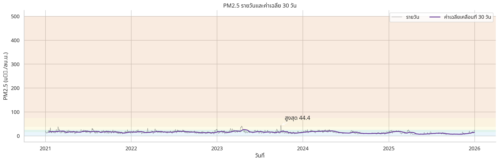

**กราฟนี้แสดงอะไร:** เส้นสีเทาคือค่ารายวัน เส้นสีม่วงคือค่าเฉลี่ยเคลื่อนที่ 30 วัน สีพื้นหลังคือระดับ TH AQI

**สิ่งที่พบ**
- ตลอด 5 ปี PM2.5 อยู่ในโซน**ดีมาก/ดี**เกือบทั้งหมด
- มีพีคชัดสองช่วงในปี 2023 คือ **เมษายน** และ**ปลายกันยายน** (สูงสุด **44.4** วันที่ 30 ก.ย. 2023)
- เส้นเฉลี่ย 30 วันค่อย ๆ ต่ำลงในปี 2024–2025

**ข้อควรแก้:** แกน y ยาวถึง 500 ตามขอบบนของเกณฑ์ AQI ทำให้เส้นข้อมูลแบนติดพื้น ควรตั้ง `ax.set_ylim(0, 50)` จะเห็นการขึ้นลงชัดขึ้นมาก

### 3.2 ค่าเฉลี่ยรายปี

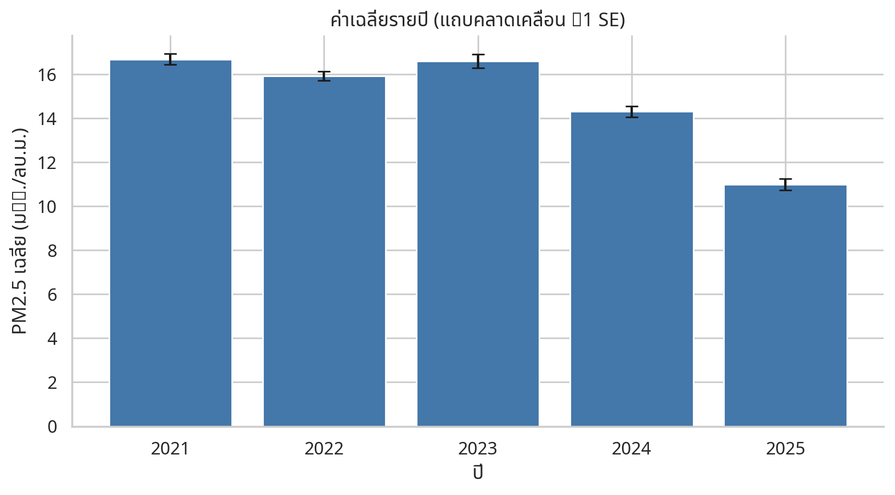

**กราฟนี้แสดงอะไร:** PM2.5 เฉลี่ยของแต่ละปี error bar คือ ±1 standard error

| ปี | ค่าเฉลี่ย | SD | จำนวนวัน |
|---|---|---|---|
| 2021 | 16.68 | 4.57 | 365 |
| 2022 | 15.92 | 4.03 | 362 |
| 2023 | 16.61 | 5.90 | 363 |
| 2024 | 14.30 | 4.66 | 365 |
| 2025 | 10.99 | 4.76 | 349 |

**สิ่งที่พบ**
- ปี 2021–2023 ใกล้เคียงกัน (ประมาณ 16–17) แล้ว**ลดลงชัด**ในปี 2024 และ 2025 ปี 2025 ต่ำกว่าปี 2021 ประมาณ 34%
- ปี 2023 มี SD สูงสุด (5.90) แปลว่าปีนั้นค่าแกว่งมากที่สุด สอดคล้องกับพีคสองช่วงในข้อ 3.1
- error bar สั้นมากเพราะแต่ละปีมีข้อมูลเกือบ 365 วัน ความต่างระหว่างปีจึงน่าจะไม่ใช่ความบังเอิญ

### 3.3 Heatmap ค่าเฉลี่ยตามปีและเดือน

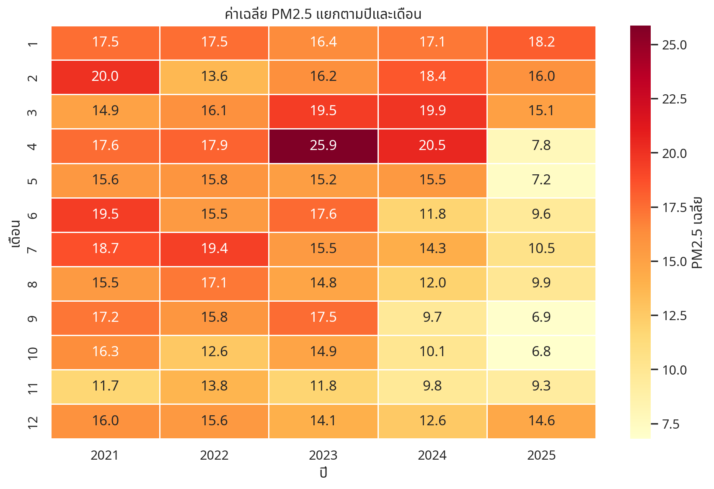

**กราฟนี้แสดงอะไร:** แต่ละช่องคือค่าเฉลี่ยของเดือนนั้นในปีนั้น ยิ่งสีเข้มยิ่งฝุ่นมาก

**สิ่งที่พบ**
- **อ่านตามแนวนอน (ฤดูกาล):** แถว ม.ค.–เม.ย. สีเข้มเกือบทุกปี แถว ต.ค.–พ.ย. สีอ่อน
- **ช่องที่สูงสุด** คือ เม.ย. 2023 (**25.9**) เป็นเดือนเดียวที่เกิน 21
- **ปี 2025 ผิดปกติ:** ตั้งแต่ เม.ย. ถึง ต.ค. ค่าอยู่ที่ 6.8–10.5 ต่ำกว่าเดือนเดียวกันของปีก่อน ๆ ประมาณครึ่งหนึ่ง เช่น เม.ย. 2024 = 20.5 แต่ เม.ย. 2025 = 7.8

**ข้อควรตรวจสอบ:** ค่าที่ตกลงกะทันหันตั้งแต่ เม.ย. 2025 อาจเกิดจากสภาพอากาศจริง หรือจากการเปลี่ยนเครื่องมือหรือวิธีวัดของสถานี ควรเช็กกับรายงานของกรมควบคุมมลพิษก่อนสรุปว่าอากาศดีขึ้นจริง

### 3.4 Box plot รายเดือน

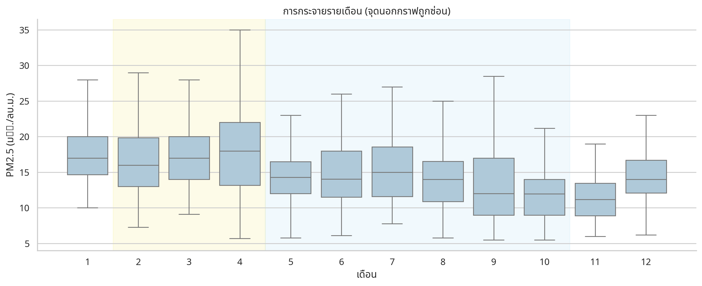

**กราฟนี้แสดงอะไร:** การกระจายของ PM2.5 ในแต่ละเดือน (รวมทุกปี) กล่องคือช่วง 25–75% เส้นกลางกล่องคือมัธยฐาน ไม่แสดงจุด outlier
- พื้นหลังสีเหลืองคือฤดูแล้ง (ก.พ.–เม.ย.)
- พื้นหลังสีฟ้าคือมรสุมตะวันตกเฉียงใต้ (พ.ค.–ต.ค.)

**สิ่งที่พบ**
- **เม.ย. สูงสุด** (มัธยฐานประมาณ 18) และกล่องกว้างที่สุด คือบางปีสูงมาก บางปีต่ำมาก
- **พ.ย. ต่ำสุด** (มัธยฐานประมาณ 11)
- ก.ย. กล่องกว้างและหนวดยาวถึงประมาณ 28 แม้มัธยฐานจะต่ำ แปลว่าเดือนนี้มักสะอาด แต่บางปีมีเหตุการณ์ฝุ่นสูง ดูข้อ 6.2

### 3.5 จำนวนวันในแต่ละระดับคุณภาพอากาศ

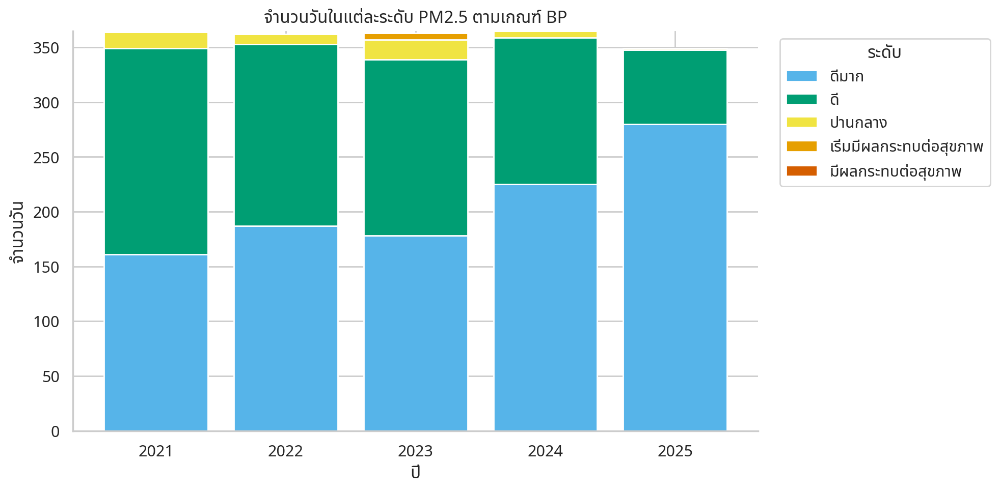

**กราฟนี้แสดงอะไร:** กราฟแท่งซ้อนนับจำนวนวันในแต่ละระดับ TH AQI ของแต่ละปี

**สิ่งที่พบ**
- วัน**ดีมาก** (สีฟ้า) เพิ่มจากประมาณ 160 วันในปี 2021 เป็นประมาณ 280 วันในปี 2025
- วัน**ปานกลาง** (สีเหลือง) มีมากที่สุดในปี 2021 และ 2023 ส่วนปี 2025 แทบไม่มี
- วัน**เริ่มมีผลกระทบต่อสุขภาพ** (สีส้ม) มีเฉพาะปี 2023 (6 วัน) และปี 2021 (1 วัน ซึ่งเล็กจนมองไม่เห็นในกราฟ)
- ไม่มีวันไหนถึงระดับ**มีผลกระทบต่อสุขภาพ** (สีแดง) เลย

---

## 4. ความสัมพันธ์กับแต่ละปัจจัย

### 4.1 Correlation heatmap (Spearman)

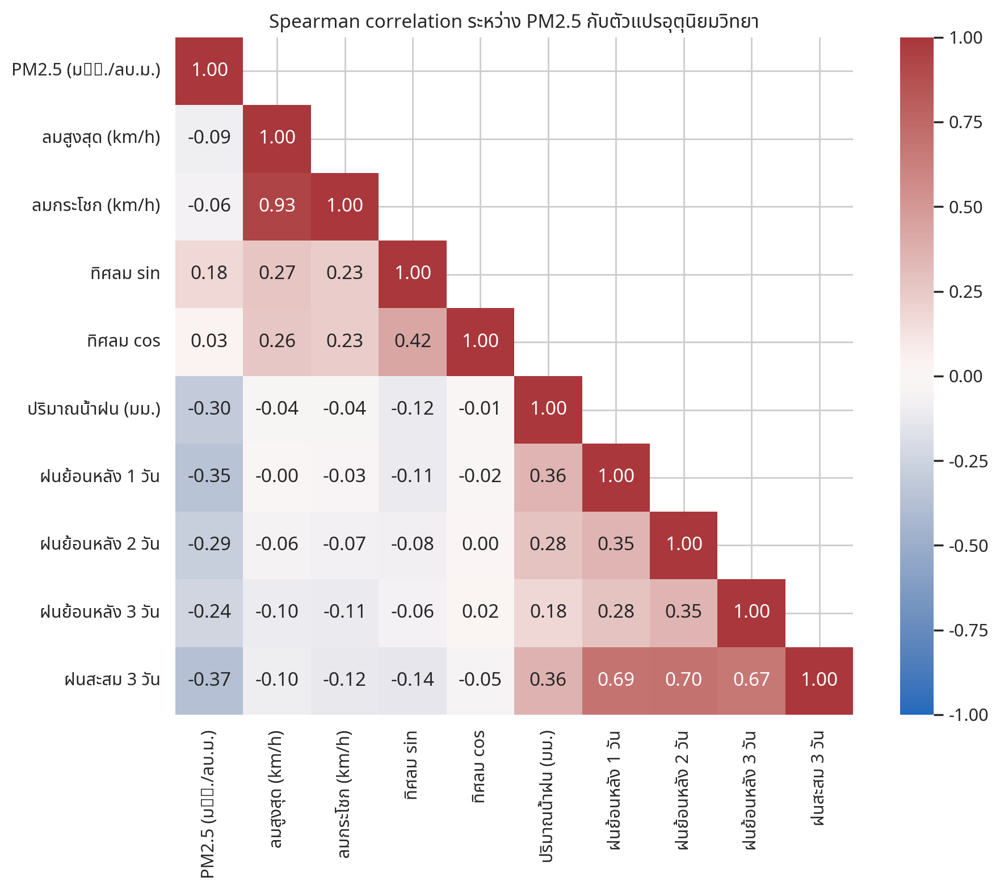

**กราฟนี้แสดงอะไร:** ค่าสหสัมพันธ์แบบ Spearman ระหว่างทุกคู่ตัวแปร
- **สีแดง** = สัมพันธ์ไปทางเดียวกัน
- **สีน้ำเงิน** = สัมพันธ์สวนทางกัน
- **ยิ่งเข้มยิ่งสัมพันธ์มาก**

**วิธีอ่าน:** คอลัมน์แรก (PM2.5) คือคอลัมน์ที่สำคัญที่สุด ช่องอื่นเป็นความสัมพันธ์ระหว่างปัจจัยด้วยกันเอง

**สิ่งที่พบ**
- ตัวแปร**ฝนทุกตัว**เป็นสีน้ำเงิน แปลว่าฝนมากฝุ่นน้อย ตัวที่เข้มที่สุดคือฝนสะสม 3 วัน (−0.37) และฝนย้อนหลัง 1 วัน (−0.35)
- **ลม** แทบไม่สัมพันธ์กับฝุ่น (−0.09 และ −0.06)
- **ทิศลม sin** = +0.18 ค่า sin เป็นบวกเมื่อลมมาจากฝั่งตะวันออก จึงแปลว่าลมตะวันออกมาพร้อมฝุ่นมากขึ้นเล็กน้อย
- **ลมสูงสุดกับลมกระโชกสัมพันธ์กันถึง 0.93** แทบเป็นข้อมูลเดียวกัน ถ้าใส่ทั้งสองตัวในโมเดล ความสำคัญจะถูกแบ่งกันระหว่างสองตัว

**ข้อสังเกต:** ไม่มีช่องไหนในคอลัมน์ PM2.5 เกิน |0.4| แปลว่า**ไม่มีปัจจัยเดียวที่อธิบายฝุ่นได้** เป็นเหตุผลที่ต้องดูกราฟแบบอื่นต่อ

### 4.2 จัดอันดับความสัมพันธ์กับ PM2.5

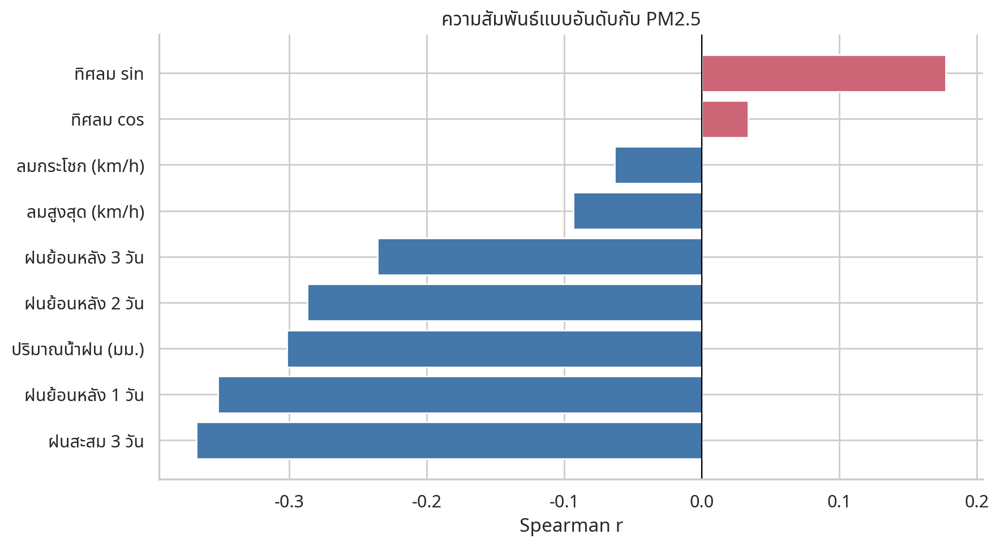

**กราฟนี้แสดงอะไร:** เอาคอลัมน์แรกของ heatmap มาเรียงเป็นกราฟแท่ง อ่านง่ายกว่า เหมาะใช้ในสไลด์

| ตัวแปร | Spearman r | p-value |
|---|---|---|
| ฝนสะสม 3 วัน | −0.37 | < 0.001 |
| ฝนย้อนหลัง 1 วัน | −0.35 | < 0.001 |
| ปริมาณน้ำฝน (วันเดียวกัน) | −0.30 | < 0.001 |
| ฝนย้อนหลัง 2 วัน | −0.29 | < 0.001 |
| ฝนย้อนหลัง 3 วัน | −0.24 | < 0.001 |
| ทิศลม sin | +0.18 | < 0.001 |
| ลมสูงสุด | −0.09 | < 0.001 |
| ลมกระโชก | −0.06 | 0.007 |
| ทิศลม cos | +0.03 | 0.15 (ไม่มีนัยสำคัญ) |

**ข้อควรระวัง:** ข้อมูลมีประมาณ 1,800 วัน ค่า r เล็ก ๆ อย่าง −0.09 ก็ยังได้ p < 0.05 ได้ ดังนั้นควรดู**ขนาดของ r** ประกอบด้วย ไม่ใช่ดูแค่ p-value

### 4.3 PM2.5 แยกตามปริมาณฝน

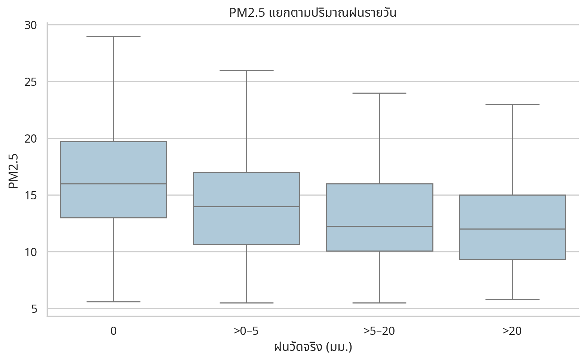

**กราฟนี้แสดงอะไร:** box plot ของ PM2.5 แยกเป็น 4 กลุ่มตามฝนวันนั้น (0 / มากกว่า 0–5 / มากกว่า 5–20 / มากกว่า 20 มม.)

**สิ่งที่พบ**
- มัธยฐานลดลงเป็นขั้นบันได: 16 → 14 → ประมาณ 12 → 12
- **ผลมากที่สุดอยู่ที่ช่วงจากไม่มีฝนเป็นมีฝนนิดหน่อย** เมื่อเกิน 5 มม. ไปแล้ว ฝนที่มากขึ้นไม่ได้ลดฝุ่นเพิ่มเท่าไร
- วันที่ไม่มีฝน PM2.5 เฉลี่ย 16.4 วันที่ฝนตกเฉลี่ย 13.4

**ทำไมใช้ box plot แทน scatter:** ฝนเป็น 0 เกินครึ่งของวันทั้งหมด ถ้าทำ scatter จุดจะกองซ้อนกันที่ x = 0 จนอ่านไม่ออก

### 4.4 ความเร็วลมกับ PM2.5

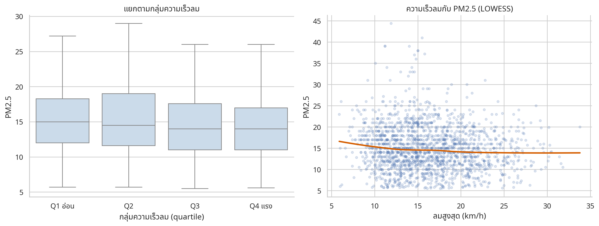

**กราฟนี้แสดงอะไร**
- **ซ้าย:** box plot แยกลมเป็น 4 กลุ่มตาม quartile จาก Q1 (อ่อนสุด) ถึง Q4 (แรงสุด)
- **ขวา:** scatter ทุกวัน พร้อมเส้น LOWESS สีส้ม ซึ่งเป็นเส้นแนวโน้มที่โค้งตามข้อมูลได้

**สิ่งที่พบ**
- มัธยฐานลดลงเล็กน้อยจาก 15 (Q1) เป็น 14 (Q4)
- เส้น LOWESS ลดจากประมาณ 16.5 ที่ลม 6 km/h เป็นประมาณ 14 ที่ลม 20 km/h แล้ว**แบนราบ**
- วันที่ฝุ่นสูงมาก (มากกว่า 35) กระจุกอยู่ที่ลม 10–17 km/h ไม่ใช่วันที่ลมอ่อนที่สุด

**ข้อสรุป:** ลมอ่อนมาก (ต่ำกว่า 10 km/h) มีแนวโน้มฝุ่นสูงขึ้นบ้าง แต่โดยรวม**ความเร็วลมไม่ใช่ปัจจัยหลัก**ในพื้นที่นี้

### 4.5 Polar plot: PM2.5 ตามทิศและความเร็วลม

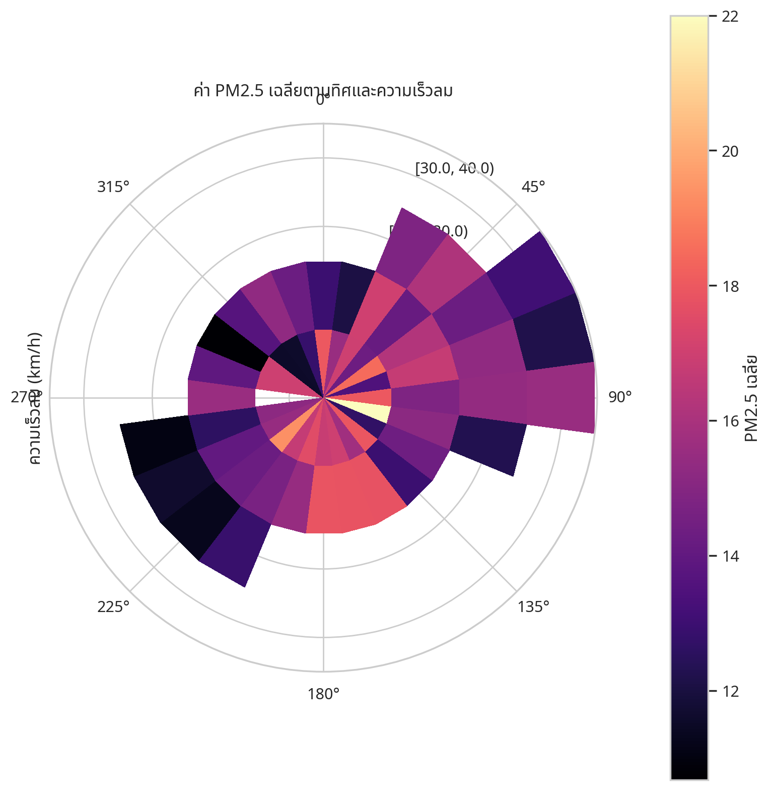

**กราฟนี้แสดงอะไร**
- **มุม** คือทิศที่ลมพัดมา (0° = เหนือ, 90° = ตะวันออก, 180° = ใต้, 270° = ตะวันตก)
- **ระยะจากจุดศูนย์กลาง** คือความเร็วลม วงในสุดคือ 0–10 km/h วงถัดไปคือ 10–20, 20–30, 30–40
- **สีแต่ละช่อง** คือ PM2.5 เฉลี่ย ยิ่งสว่างยิ่งฝุ่นมาก

**สิ่งที่พบ**
- **ช่องที่สว่างที่สุด** (ประมาณ 22) คือลม**ตะวันออกถึงตะวันออกเฉียงใต้ (ประมาณ 90–105°) ที่ความเร็วต่ำกว่า 10 km/h**
- ลม**ทิศใต้ (ประมาณ 165–195°) ที่ 10–20 km/h** ก็สว่าง (ประมาณ 18)
- ลม**ตะวันตกเฉียงใต้ที่แรง** (20–40 km/h ที่ 225–255°) มืดที่สุด (ประมาณ 11) ลมกลุ่มนี้คือมรสุมตะวันตกเฉียงใต้ ซึ่งพาอากาศสะอาดจากทะเลอันดามันมาและมาพร้อมฝน
- ไม่มีข้อมูลลมจากทิศเหนือถึงตะวันตกเฉียงเหนือที่แรงเลย ส่วนนั้นในกราฟจึงว่างเปล่า

**ข้อควรระวัง:** ช่องที่อยู่ขอบนอกมีจำนวนวันน้อย ค่าเฉลี่ยอาจไม่นิ่ง ถ้าจะให้ดีควรซ่อนช่องที่มีน้อยกว่าประมาณ 5 วัน

**ข้อควรแก้:** ป้ายบอกความเร็วลม ([10.0, 20.0) และ [30.0, 40.0)) ซ้อนกับแท่งข้อมูล และคำว่า "ความเร็วลม" ทับกับ "270°" ควรย้ายตำแหน่งป้ายด้วย `ax.set_rlabel_position()`

### 4.6 Wind rose: วันปกติกับวันที่ฝุ่นสูง 10%

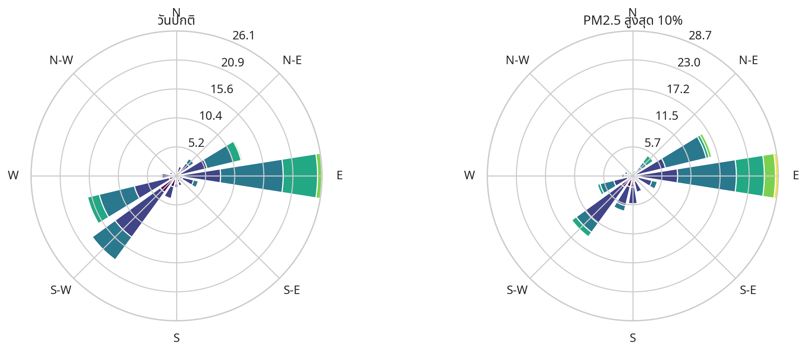

**กราฟนี้แสดงอะไร:** แต่ละกลีบคือสัดส่วน (%) ของวันที่ลมพัดมาจากทิศนั้น สีในกลีบคือช่วงความเร็วลม
- **ซ้าย:** วันปกติ (PM2.5 ต่ำกว่า 21.2)
- **ขวา:** วันที่ฝุ่นสูงสุด 10% (PM2.5 ตั้งแต่ 21.2 ขึ้นไป)

| ทิศลม | วันปกติ | วันฝุ่นสูง 10% |
|---|---|---|
| ตะวันออก (E) | 36.5% | **41.4%** |
| ตะวันออกเฉียงเหนือ (NE) | 9.2% | **12.7%** |
| ใต้ (S) | 4.6% | **9.9%** |
| ตะวันตกเฉียงใต้ (SW) | **31.9%** | 24.3% |
| ตะวันตก (W) | **9.4%** | 5.5% |

**สิ่งที่พบ**
- ในวันฝุ่นสูง ลม**ตะวันออก ตะวันออกเฉียงเหนือ และใต้**เพิ่มขึ้น ส่วนลม**ตะวันตกเฉียงใต้และตะวันตก**ลดลง
- สอดคล้องกับข้อ 4.5 คือลมตะวันตกเฉียงใต้มาพร้อมอากาศสะอาด

**ข้อควรระวัง: ทิศลมกับฤดูกาลพันกันอยู่** วันฝุ่นสูงประมาณ 60% อยู่ในช่วง ม.ค.–เม.ย. ซึ่งเป็นช่วงที่ลมตะวันออกพัดเป็นหลักอยู่แล้ว กราฟนี้จึงแยกไม่ได้ว่าฝุ่นมากับลมตะวันออกจริง หรือแค่เป็นฤดูที่ฝุ่นสูงอยู่แล้ว ถ้าจะแยกให้ชัด ควรทำ wind rose แยกตามฤดู

**ข้อควรแก้:** กราฟยังไม่มี legend บอกว่าสีแต่ละสีคือความเร็วลมช่วงไหน ให้เพิ่ม `ax.set_legend()`

### 4.7 Lag analysis: ฝนย้อนหลังกี่วันยังมีผล

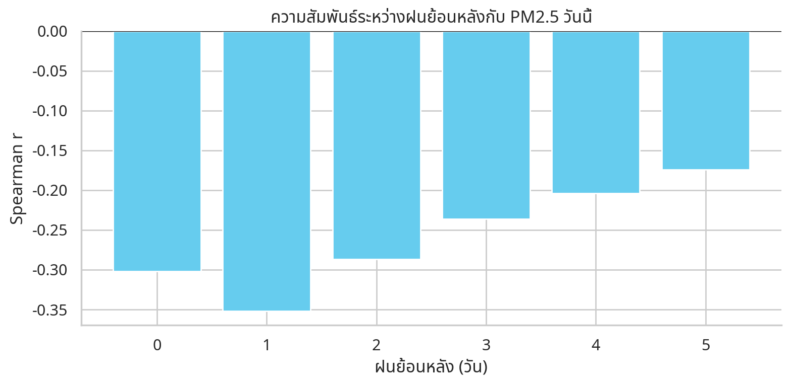

**กราฟนี้แสดงอะไร:** ค่า Spearman r ระหว่างฝุ่นวันนี้กับฝนของวันนี้ (lag 0), เมื่อวาน (lag 1), ไปจนถึง 5 วันก่อน (lag 5)

**สิ่งที่พบ**
- **ฝนเมื่อวาน (lag 1) สัมพันธ์มากที่สุด** (−0.35) มากกว่าฝนวันนี้ (−0.30)
- หลังจากนั้นค่อย ๆ อ่อนลง: −0.29 → −0.24 → −0.20 → −0.17
- แม้ย้อนไป 5 วันก็ยังเป็นลบ

**ตีความ**
- ฝนวันนี้อาจตกช่วงเย็น ขณะที่ค่าฝุ่นเฉลี่ยทั้งวันเก็บช่วงเช้าที่ยังไม่มีฝนไปแล้ว ฝนเมื่อวานจึงล้างฝุ่นได้ครบทั้งวันของวันนี้
- ค่าที่ยังเป็นลบถึง 5 วัน อาจไม่ใช่ผลของการชะล้างโดยตรง แต่เป็นเพราะวันฝนตกมักมาเป็นช่วงยาวในฤดูฝน ซึ่งฝุ่นต่ำอยู่แล้ว

### 4.8 PM2.5 แยกตามประเภทวัน

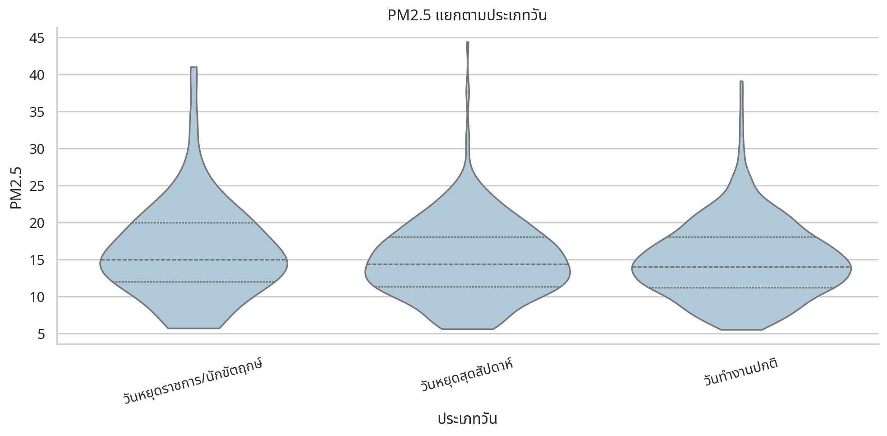

**กราฟนี้แสดงอะไร:** violin plot ของแต่ละประเภทวัน ความกว้างคือจำนวนวันที่ค่านั้น เส้นประกลางคือมัธยฐาน เส้นจุดคือ 25% และ 75%

| ประเภทวัน | มัธยฐาน | ค่าเฉลี่ย | จำนวนวัน |
|---|---|---|---|
| วันหยุดราชการ/นักขัตฤกษ์ | 15.0 | 16.0 | 135 |
| วันหยุดสุดสัปดาห์ | 14.4 | 14.9 | 490 |
| วันทำงานปกติ | 14.0 | 14.8 | 1,179 |

**สิ่งที่พบ**
- วันหยุดนักขัตฤกษ์สูงกว่าเล็กน้อย แต่ทั้งสามรูปทรงแทบซ้อนกันได้
- **Kruskal-Wallis: H = 3.59, p = 0.17** ความต่างนี้**ไม่มีนัยสำคัญทางสถิติ**

**ข้อสรุป:** จากข้อมูลนี้ยังไม่พบหลักฐานว่ากิจกรรมของมนุษย์ที่ต่างกันระหว่างวันทำงานกับวันหยุดส่งผลต่อฝุ่น

> หมายเหตุ: เซลล์ Kruskal-Wallis ใน notebook ดูเหมือนจะเขียนไม่เสร็จ ค่า H และ p ข้างบนผมคำนวณแยกจาก notebook ควรเพิ่มโค้ดส่วนนี้ให้ครบใน notebook ด้วย

---

## 5. ปัจจัยที่ส่งผลร่วมกัน

### 5.1 ฝนและลมพร้อมกัน

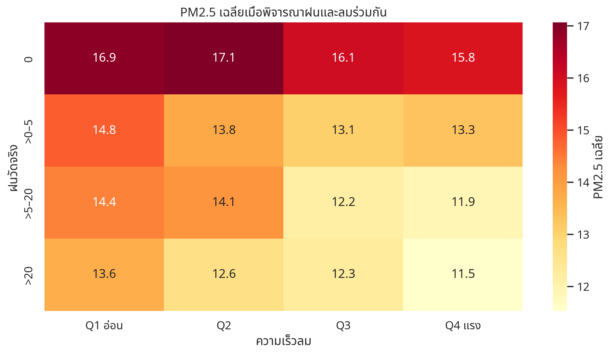

**กราฟนี้แสดงอะไร:** แถวคือกลุ่มฝน คอลัมน์คือกลุ่มความเร็วลม ตัวเลขในช่องคือ PM2.5 เฉลี่ย

**สิ่งที่พบ**
- **สูงสุด:** ไม่มีฝนและลมอ่อนถึงปานกลาง (Q2) = **17.1**
- **ต่ำสุด:** ฝนมากกว่า 20 มม. และลมแรง (Q4) = **11.5**
- **ฝนมีผลมากกว่าลม** ในคอลัมน์เดียวกัน ค่าลดลงประมาณ 3–4 เมื่อฝนเพิ่มขึ้น ส่วนในแถวเดียวกัน ค่าลดลงแค่ประมาณ 1–2 เมื่อลมแรงขึ้น
- แถวบนสุด (ไม่มีฝน) เป็นสีแดงทั้งแถว แม้ลมแรงก็ยังได้ 15.8 แปลว่าลมอย่างเดียวช่วยได้ไม่มากถ้าไม่มีฝน

### 5.2 ผลของฝนแยกตามฤดู

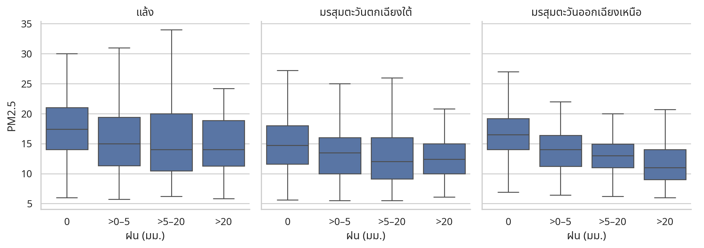

**กราฟนี้แสดงอะไร:** กราฟเดียวกับข้อ 4.3 แต่แยกเป็น 3 ฤดู
- **แล้ง:** ก.พ.–เม.ย.
- **มรสุมตะวันตกเฉียงใต้:** พ.ค.–ต.ค.
- **มรสุมตะวันออกเฉียงเหนือ:** พ.ย.–ม.ค.

**สิ่งที่พบ**
- **มรสุมตะวันออกเฉียงเหนือ** เห็นขั้นบันไดชัดที่สุด มัธยฐานลดจากประมาณ 16.5 เหลือประมาณ 11 เมื่อฝนมากกว่า 20 มม.
- **ฤดูแล้ง** ฝุ่นสูงที่สุดในทุกกลุ่มฝน และกล่องกว้าง แม้ฝนมากกว่า 5–20 มม. หนวดก็ยังยาวถึง 34 แปลว่าฝนช่วงแล้งช่วยได้ไม่แน่นอน
- **มรสุมตะวันตกเฉียงใต้** ฝุ่นต่ำโดยรวม และผลของฝนอยู่ระดับปานกลาง

### 5.3 Correlation แยกตามฤดู

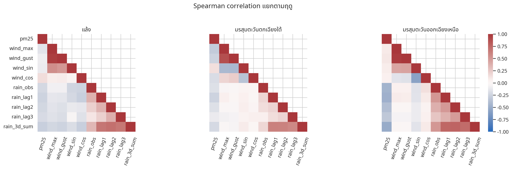

**กราฟนี้แสดงอะไร:** heatmap แบบข้อ 4.1 แยกทีละฤดู ให้ดูแถวแรก (pm25) เป็นหลัก

ค่า r ระหว่าง PM2.5 กับแต่ละปัจจัย (ผมคำนวณแยกจาก notebook อาจต่างจากกราฟเล็กน้อย เพราะวิธีจัดการ lag ต่างกัน):

| ฤดู | ลมสูงสุด | ฝนวันนี้ | ฝนย้อนหลัง 1 วัน | ฝนสะสม 3 วัน |
|---|---|---|---|---|
| แล้ง | −0.15 | −0.22 | −0.26 | −0.28 |
| มรสุมตะวันตกเฉียงใต้ | **−0.30** | −0.18 | −0.26 | −0.22 |
| มรสุมตะวันออกเฉียงเหนือ | +0.09 | **−0.46** | **−0.48** | **−0.51** |

**สิ่งที่พบ**
- **ปัจจัยสำคัญเปลี่ยนไปตามฤดู** เป็นข้อค้นพบที่ heatmap รวมทั้งชุดมองไม่เห็น
  - **มรสุมตะวันออกเฉียงเหนือ:** **ฝน**ผลมากที่สุด r ถึง −0.5 เพราะเป็นช่วงที่ฝนตกหนักของภาคใต้ฝั่งตะวันออก
  - **มรสุมตะวันตกเฉียงใต้:** **ลม**ผลมากที่สุด ลมแรงพัดฝุ่นออกไป
  - **ฤดูแล้ง:** ทุกปัจจัยสัมพันธ์อ่อน แปลว่ามีปัจจัยอื่นที่เราไม่มีข้อมูล เช่น การเผาในที่โล่ง หรือความสูงชั้นผสมอากาศ

**ข้อควรแก้:** กราฟนี้ไม่มีตัวเลขในช่อง และชื่อตัวแปรเป็นภาษาอังกฤษ ควรใส่ `annot=True, fmt=".2f"` และใช้ชื่อไทยแบบข้อ 4.1

---

## 6. เจาะลึกช่วงที่ฝุ่นสูงผิดปกติในปี 2023

**ทำไมต้องดูช่วงนี้:** ตลอด 5 ปีมีวันที่ AQI เกิน 100 แค่ 7 วัน และ 6 วันในนั้นอยู่ในสองช่วงนี้ ฝุ่นช่วงนี้อาจมาจากสาเหตุที่ต่างจากวันปกติ

**วิธีอ่านกราฟ**
- **ชั้นบน:** PM2.5 รายวัน เส้นประสีส้มคือเปอร์เซ็นไทล์ 90 ของทั้งชุด (21.2)
- **ชั้นกลาง:** ฝนรายวัน
- **ชั้นล่าง:** ลูกศรทิศลม ความยาวคือความเร็ว

> **ข้อควรระวังเรื่องลูกศร:** โค้ดวาดลูกศรให้**ชี้ไปทางทิศที่ลมพัดมา** ซึ่งกลับกับแผนที่อากาศทั่วไปที่ชี้ไปทางที่ลมพัดไป เช่น ลูกศรชี้ลงคือลมพัดมาจากทิศใต้ ควรเขียนบอกไว้ในกราฟ หรือกลับทิศลูกศรด้วย `u, v = -u, -v`

### 6.1 มีนาคม–พฤษภาคม 2023

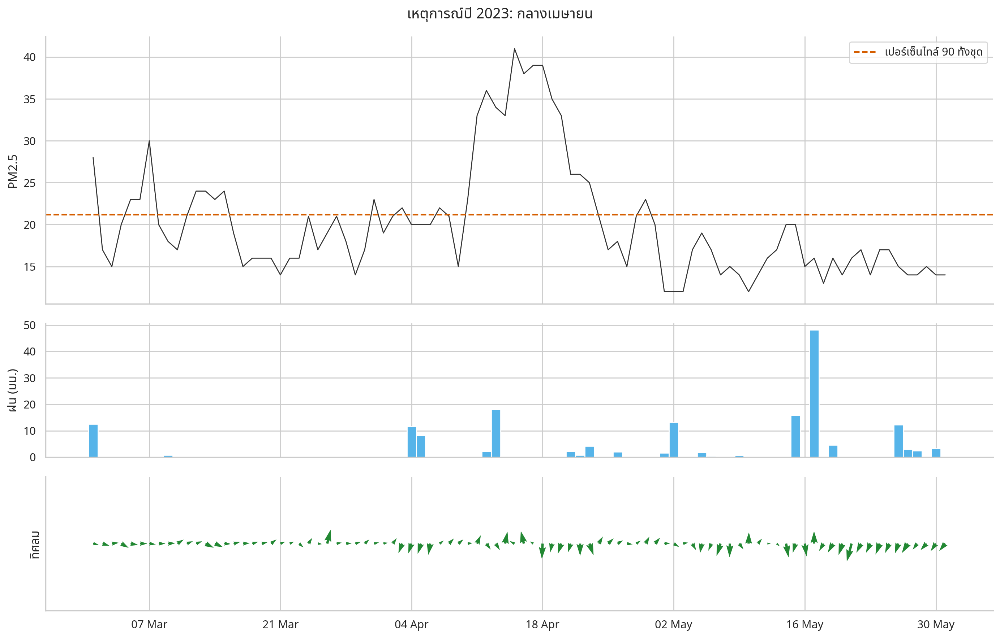

**สิ่งที่พบ**
- PM2.5 พุ่งขึ้นช่วง **10–22 เม.ย.** สูงสุด 41 วันที่ 15 เม.ย. และอยู่เหนือ 33 ติดต่อกันประมาณ 1 สัปดาห์
- ก่อนพีคเป็นช่วงที่**ฝนน้อยมาก** มีฝนตกประปรายแค่ไม่กี่วัน
- ทิศลมช่วงพีคเปลี่ยนไปมา มีทั้งจากตะวันตกและตะวันตกเฉียงเหนือ (278–319°) และจากใต้ (190°) ต่างจากต้นเดือนมีนาคมที่เป็นลมตะวันออกสม่ำเสมอ
- ฝุ่นลดลงหลังมีฝนช่วงปลายเมษายน และหลัง**ฝนหนัก 48 มม.** กลางเดือนพฤษภาคมก็ไม่กลับขึ้นไปสูงอีก

### 6.2 กันยายน–ตุลาคม 2023

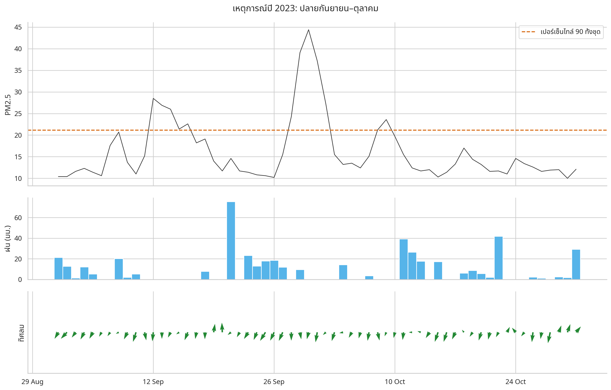

**สิ่งที่พบ**
- มีสองพีค: **12 ก.ย.** (ประมาณ 28) และ **28 ก.ย.–1 ต.ค.** (สูงสุด **44.4** วันที่ 30 ก.ย. ซึ่งเป็นค่าสูงสุดของทั้งชุด)
- พีคใหญ่เกิด**ทันทีหลังฝนหยุด** ช่วง 20–26 ก.ย. มีฝนตกเกือบทุกวัน ฝุ่นต่ำประมาณ 10–11 พอฝนหยุด ฝุ่นขึ้นจาก 10 เป็น 44 ในไม่กี่วัน
- ลมทั้งช่วงมาจาก**ทิศใต้ถึงตะวันตกเฉียงใต้** (ประมาณ 156–211°) อย่างสม่ำเสมอ
- ฝุ่นลดลงอีกครั้งเมื่อฝนกลับมาช่วง 10 ต.ค.

**สมมติฐาน (ยังต้องพิสูจน์):**
- ฝุ่นขึ้นเร็วมากทั้งที่ลมมาจากทิศใต้ถึงตะวันตกเฉียงใต้ต่อเนื่อง เข้าเค้า**หมอกควันข้ามแดน**จากไฟป่าในสุมาตรา ปี 2023 เป็นปีเอลนีโญ และมีรายงานไฟป่าในอินโดนีเซียช่วงเดือนกันยายนถึงตุลาคม
- ถ้าจะยืนยัน ต้องใช้ข้อมูลจุดความร้อน (hotspot) จาก NASA FIRMS ประกอบ

---

## 7. โมเดลดูความสำคัญของแต่ละปัจจัย (Random Forest)

**การตั้งค่า:** train ด้วยปี 2021–2024 และ test ด้วยปี 2025 ไม่ใส่ฝุ่นเมื่อวาน (`pm25_lag1`) เพื่อไม่ให้ autocorrelation กลบปัจจัยอื่น

> **ผลที่ต้องรู้ก่อนอ่านกราฟในส่วนนี้: R² บนปี 2025 = −0.90, MAE = 5.74**
>
> R² ติดลบแปลว่าโมเดล**ทายแย่กว่าการเดาค่าเฉลี่ยทุกวัน** สาเหตุหลักคือปี 2025 ฝุ่นต่ำกว่าปีก่อน ๆ มาก (ดูข้อ 3.3) โมเดลเรียนจากปีที่ฝุ่นสูงกว่า จึงทายสูงเกินไปตลอด
>
> - ข้อนี้**เป็นข้อค้นพบในตัวมันเอง** คือตัวแปรอากาศที่มีอยู่ (ฝน ลม เดือน) อธิบายการลดลงของปี 2025 ไม่ได้ ต้องมีปัจจัยอื่นที่เราไม่ได้วัด
> - กราฟ importance และ SHAP ข้างล่าง**บอกได้ว่าโมเดลพึ่งตัวแปรไหน** แต่ไม่ควรตีความว่าเป็นกลไกจริงในธรรมชาติ
> - ถ้าอยากได้ importance ที่เชื่อถือได้กว่านี้ ลองใช้ cross-validation แบบแบ่งตามปี (`GroupKFold` โดยให้แต่ละปีเป็นหนึ่งกลุ่ม) หรือใส่ปีเป็น feature ด้วย

### 7.1 Permutation importance

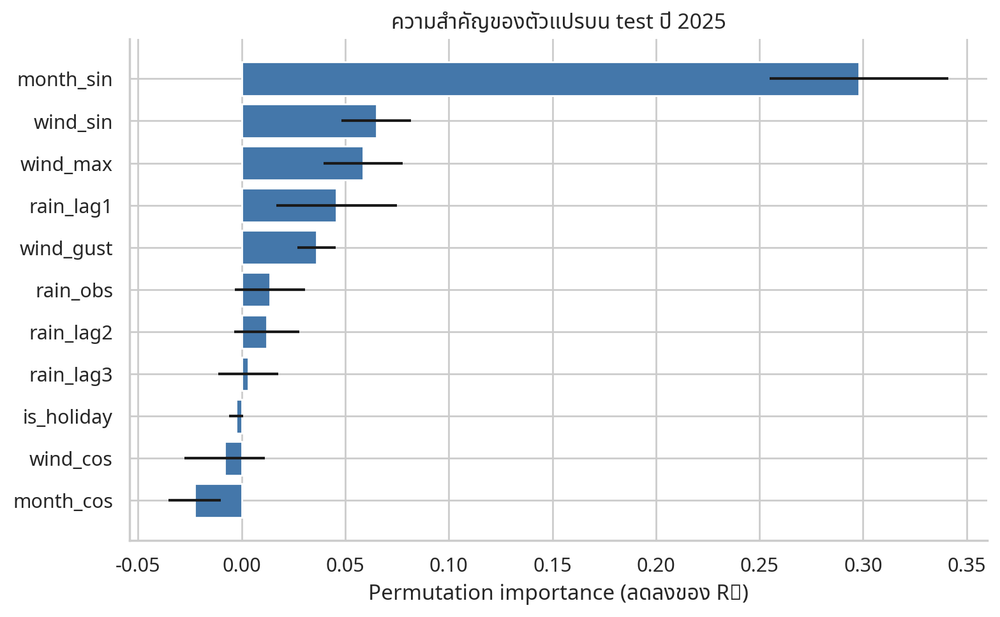

**กราฟนี้แสดงอะไร:** ถ้าสลับค่าของตัวแปรนั้นแบบสุ่ม R² จะลดลงเท่าไร ยิ่งลดมาก ตัวแปรยิ่งสำคัญต่อโมเดล เส้นดำคือความแปรปรวนจากการสุ่ม 20 รอบ

**สิ่งที่พบ**
- **`month_sin` สำคัญที่สุดอย่างทิ้งห่าง** (0.29) ค่านี้สูงช่วง ม.ค.–พ.ค. (สูงสุดที่ มี.ค.) และต่ำช่วง ก.ค.–พ.ย. จึงเป็นตัวแทน**ฤดูกาล**
- ตัวที่สำคัญรองลงมาคือ `wind_sin` (0.07), `wind_max` (0.05) และ `rain_lag1` (0.04)
- `is_holiday`, `wind_cos` และ `month_cos` มีค่าใกล้ 0 หรือติดลบ แปลว่าไม่ช่วยโมเดลเลย

### 7.2 SHAP beeswarm

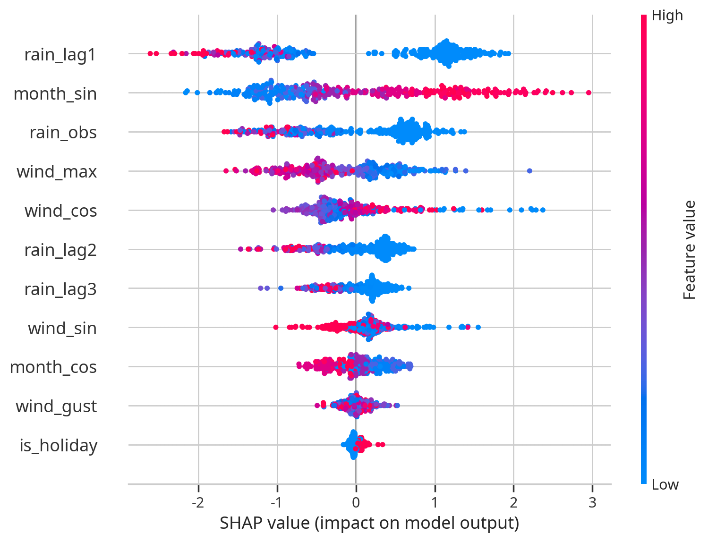

**กราฟนี้แสดงอะไร:** แต่ละจุดคือหนึ่งวันในปี 2025
- **แกน x** คือตัวแปรนั้นดันค่าทำนายขึ้น (ขวา) หรือลง (ซ้าย) ไปกี่หน่วย
- **สีจุด** คือค่าของตัวแปรนั้น แดง = สูง น้ำเงิน = ต่ำ

**สิ่งที่พบ**
- **`rain_lag1` ขึ้นมาเป็นอันดับ 1** แยกเป็นสองกลุ่มชัดเจน
  - เมื่อวานไม่มีฝน (จุดน้ำเงิน) ค่าทำนาย**เพิ่มขึ้นประมาณ +1 ถึง +2**
  - เมื่อวานมีฝน (จุดแดง/ม่วง) ค่าทำนาย**ลดลงประมาณ −1 ถึง −2.5**
- **`month_sin`:** จุดแดง (ช่วงแล้ง) อยู่ขวา จุดน้ำเงิน (ปลายฤดูฝน) อยู่ซ้าย ตรงกับข้อ 3.4
- **`wind_max`:** ลมแรง (แดง) อยู่ซ้าย แปลว่าลดฝุ่น ตรงกับข้อ 4.4 แต่ขนาดผลน้อยกว่าฝน
- **`is_holiday`:** แทบไม่มีผล ตรงกับข้อ 4.8

**ทำไมอันดับไม่ตรงกับข้อ 7.1:** permutation importance วัดว่า**ความแม่นยำ**ลดลงเท่าไร ส่วน SHAP วัดว่าตัวแปรนั้น**ดันค่าทำนาย**มากแค่ไหน ฝนเมื่อวานดันค่าทำนายขึ้นลงเยอะ แต่เดือนเป็นตัวที่ทำให้ความแม่นยำพังมากกว่าเมื่อถูกสลับ

### 7.3 SHAP dependence plots

#### ฝนวันนี้ (`rain_obs`)

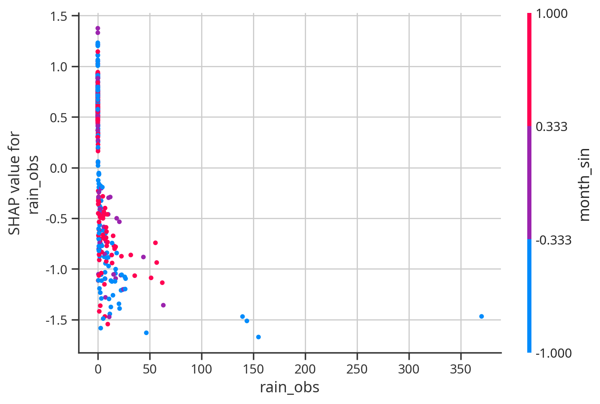

- **แกน x** คือปริมาณฝน **แกน y** คือผลต่อค่าทำนาย **สีจุด** คือ `month_sin`
- ที่ **ฝน = 0** ผลเป็นบวก (ประมาณ +0.2 ถึง +1.4)
- **ฝนเพียงไม่กี่มิลลิเมตร**ก็ทำให้ผลเป็นลบทันที (ประมาณ −0.5 ถึง −1.5)
- หลังจากนั้น**แบนราบ** ฝน 50 มม. กับ 370 มม. ให้ผลใกล้กัน (ประมาณ −1.5)
- **สรุป:** ผลของฝนเป็นแบบ**มีหรือไม่มี** มากกว่าแบบยิ่งมากยิ่งดี ตรงกับข้อ 4.3

#### ทิศลม sin (`wind_sin`: +1 = ลมจากตะวันออก, −1 = ลมจากตะวันตก)

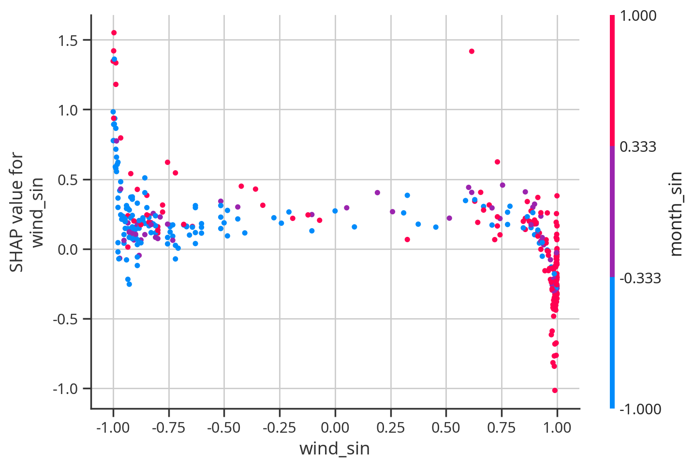

- **แกน x** คือ `wind_sin` **แกน y** คือผลต่อค่าทำนาย **สีจุด** คือ `month_sin`
- ลมจาก**ตะวันตก** (−1) ดันค่าทำนาย**ขึ้น**ได้ถึง +1.5
- ลมจาก**ตะวันออก** (+1) **ในช่วงแล้ง** (จุดแดง) ดันค่าทำนาย**ลง**ถึง −1
- **ผลนี้สวนทางกับข้อ 4.1 และ 4.6** ที่ลมตะวันออกสัมพันธ์กับฝุ่นสูงเมื่อดูทั้ง 5 ปี เป็นไปได้ว่าปี 2025 มีรูปแบบต่างจากปีอื่น หรือโมเดลที่ R² ติดลบจับรูปแบบผิด **ยังไม่ควรเอาไปสรุป**

#### ทิศลม cos (`wind_cos`: +1 = ลมจากเหนือ, −1 = ลมจากใต้)

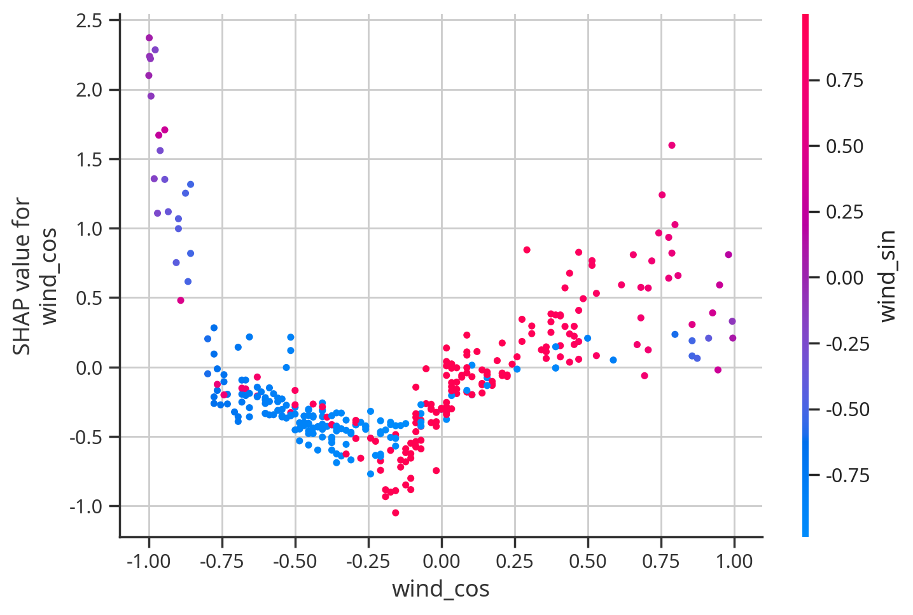

- **แกน x** คือ `wind_cos` **แกน y** คือผลต่อค่าทำนาย **สีจุด** คือ `wind_sin`
- กราฟเป็นรูป **U**
  - ลมจาก**ทิศใต้ตรง ๆ** (cos ≈ −1, sin ≈ 0) ดันค่าทำนายขึ้นมากที่สุด (+1 ถึง +2.4) สอดคล้องกับช่วงพีคเดือนกันยายน 2023 ที่ลมมาจากทิศใต้ (ข้อ 6.2) และข้อ 4.6 ที่ลมทิศใต้เพิ่มจาก 4.6% เป็น 9.9% ในวันฝุ่นสูง
  - ลม**ตะวันออกเฉียงใต้** (cos ≈ −0.2, sin เป็นบวก) ดันค่าทำนายลง
  - ลมจาก**ตะวันออกเฉียงเหนือ** (cos ≈ +0.75) ดันค่าทำนายขึ้นอีกครั้ง
- `wind_sin` และ `wind_cos` ต้องอ่านคู่กัน เพราะรวมกันแล้วจึงบอกทิศลมได้ครบ

---

## ข้อจำกัดของการวิเคราะห์

- มีข้อมูลจาก**สถานีเดียว** และ PM2.5 ขาดหาย 22 วัน
- **ยังขาดตัวแปรสำคัญ:** อุณหภูมิ ความชื้น ความสูงชั้นผสมอากาศ และจุดความร้อน (hotspot) ทำให้อธิบายฤดูแล้งกับปี 2025 ได้ไม่ดี
- **ฤดูกาลกับทิศลมพันกัน** แยกผลของสองอย่างนี้ออกจากกันได้ยาก
- โมเดลบนปี 2025 มี **R² ติดลบ** ผล importance และ SHAP จึงใช้เป็นแนวทางได้เท่านั้น
- สมมติฐานหมอกควันข้ามแดน**ยังไม่ได้ยืนยัน**

---

## ข้อควรแก้ในกราฟก่อนนำไปนำเสนอ

| ปัญหา | กราฟที่เจอ | วิธีแก้ |
|---|---|---|
| หน่วย "มคก." ขึ้นเป็นกล่องสี่เหลี่ยม | 02_pm25_distribution, 03_1, 03_2, 03_4, 04_1 | ในโค้ด 6 จุด คำว่า "มคก." พิมพ์ด้วยตัวอักษรรัสเซีย (Cyrillic) "кг" ให้แทนที่ด้วยตัวไทย "คก" |
| ตัว ± และ ² ขึ้นเป็นกล่อง | 03_2 (±1 SE), 07_1 (R²) | ตั้ง `plt.rcParams["font.family"] = [_thai_font_name, "DejaVu Sans"]` ให้มีฟอนต์สำรองสำหรับอักขระที่ Noto Sans Thai ไม่มี |
| แกน y ยาวถึง 500 จนเส้นแบน | 03_1 | `ax.set_ylim(0, 50)` |
| ป้ายความเร็วลมซ้อนกับข้อมูล | 04_5 | `ax.set_rlabel_position(...)` และย้าย ylabel |
| ไม่มี legend บอกความเร็วลม | 04_6 | `ax.set_legend(title="km/h")` |
| ไม่มีตัวเลขและชื่อเป็นภาษาอังกฤษ | 05_3 | `annot=True` และ `rename(COLUMN_LABELS)` |
| ลูกศรชี้กลับทางจากแผนที่อากาศทั่วไป | 06_* | กลับทิศ `u, v = -u, -v` หรือเขียนอธิบายในกราฟ |
| ชื่อตัวแปรเป็นภาษาอังกฤษ | 07_* | เปลี่ยนชื่อ feature เป็นภาษาไทยก่อน plot |
| เส้น grid ทับบน heatmap | 04_1 | ใส่ `ax.grid(False)` |
